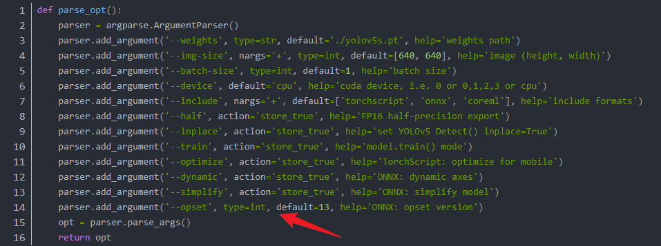

# yolov5将.pt转为.onnx

### 1.找到yolov5_master（笔记本上）

在终端打开：

```
python export.py --weights weights/best.pt --include onnx
```

#### （1）报错：Inplace update to inference tensor outside Inference，

```
./utils/torch_utils.py
```

然后修改minmum:后面的torch版本（图中绿色数字），我当前环境的torch是1.9.0版本的，所以修改大于这个版本即可


#### （2）报错：Yolov5 ONNX: export failure: Unsupported ONNX opset version: 17

在export.py 中的 def parse_opt()函数修改：将--opset的default改为12




