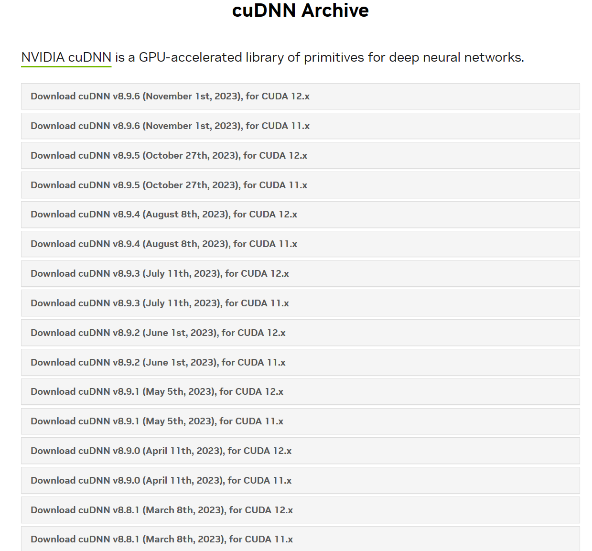

# 一、windows系统

## 1.安装显卡驱动

### （1）查看显卡驱动型号

右击右下角开始，在设备管理器中查看计算机显卡型号，例如我的显卡是GTX1050：


### （2）下载显卡驱动

进入英伟达官网，下载对应的显卡驱动：

```
https://www.nvidia.cn/Download/index.aspx?lang=cn
```


选择对应版本参数并下载安装，安装时直接一直下一步即可。

### （3）查看GPU状态

打开终端，输入： 查看当前版本支持的最高CUDA版本

```
nvidia-smi
```


## 2.安装CUDA

 CUDA各版本官方下载地址:  选择对应版本下载

```
https://developer.nvidia.com/cuda-toolkit-archive
```


### （2）安装下载好的CUDA

**注意：建议默认路径，后期需要添加环境变量，**安装时选择自定义安装：


勾选Visual Studio Integration：


### （3）设置环境变量

鼠标右键计算机（此电脑），打开属性->高级系统设置->环境变量，可以看到系统变量中多了CUDA_PATH和CUDA_PATH_V10_2两个环境变量。


接下来，还要**在系统变量中“新建”，添加以下几个环境变量，**以下是**默认安装位置的路径的环境变量（左边是变量名，右边是变量值）**:

```
CUDA_SDK_PATH = C:\ProgramData\NVIDIA Corporation\CUDA Samples\v10.2

CUDA_LIB_PATH = %CUDA_PATH%\lib\x64

CUDA_BIN_PATH = %CUDA_PATH%\bin

CUDA_SDK_BIN_PATH = %CUDA_SDK_PATH%\bin\win64

CUDA_SDK_LIB_PATH = %CUDA_SDK_PATH%\common\lib\x64
```

***\*在系统变量\**** ***\*Path\**** ***\*的末尾添加：\****

```
%CUDA_LIB_PATH%;%CUDA_BIN_PATH%;%CUDA_SDK_LIB_PATH%;%CUDA_SDK_BIN_PATH%;
```

**双击Path,再添加如下5条（默认安装路径）**

```
C:\Program Files\NVIDIA GPU Computing Toolkit\CUDA\v10.2\lib\x64

C:\Program Files\NVIDIA GPU Computing Toolkit\CUDA\v10.2\include

C:\Program Files\NVIDIA GPU Computing Toolkit\CUDA\v10.2\extras\CUPTI\lib64

C:\ProgramData\NVIDIA Corporation\CUDA Samples\v10.2\bin\win64

C:\ProgramData\NVIDIA Corporation\CUDA Samples\v10.2\common\lib\x64
```


## 3.安装cudnn

### （1）**cudnn下载地址：**

```
https://developer.nvidia.com/cudnn
```


### （2）填写邮箱验证




### （3）粘贴到cuda文件夹下

下载cudnn后直接将其解开压缩包，然后需要将解压后的bin,include,lib文件夹复制粘贴到cuda安装时的默认路径文件夹下（比如我的是在：C:\Program Files\NVIDIA GPU Computing Toolkit\CUDA\v10.2 下）

### （4）测试cuda是否配置成功：

Win+R打开CMD终端执行：nvcc -V 即可看到cuda的信息：


## 4.安装Anaconda


## 5.安装PyTorch

### （1）创建虚拟环境

在开始栏打开刚才安装的**anaconda prompt** 创建项目运行虚拟环境：

```
conda create -n your_env_name(虚拟环境名称) python==xx(想要创建的虚拟环境的python版本号)
例如：conda create -n pytorch python=3.8
```

输入y，然后按下enter确认开始下载安装。出现以下界面则虚拟环境已经创建完成。


### （2）激活并进入虚拟环境

在上一步的基础上，对创建完成的虚拟环境进行激活，**在anaconda prompt** **终端中**输入以下指令：

```
conda activate pytorch
```

### （3）安装PyTorch

 接下来进入PyTorch官网，选择相关参数，获取PyTorch安装指令，并在**anaconda prompt** 终端中执行红色框中的指令（该指令为最新版本的PyTorch）：

**注意：安装的时候要将命令后的-c pytorch后面的内容删除，从国内源进行下载，速度快一些。**

```
https://pytorch.org/
```

往下拉，找到早期版本


找到需要的版本进行安装即可

### （4）验证PyTorch是否安装成功

**在anaconda prompt** **终端中**执行以下指令：

```
python 
import torch 
torch.cuda.is_available() 
```

如下图提示**True说明框架配置成功**，且GPU可用


验证完成后Ctrl+Z回到命令行，然后执行conda list指令就可以看到该虚拟环境下已经安装好的包


## 6.环境统一

### 1.conda环境创建

#### （1）pytorch环境创建

conda的base环境在Anaconda里面，需要将pytorch环境也安装在同一个盘下。

查看虚拟环境：

```
conda info --envs
```

删除所有环境：

```
conda env remove --pytorch --all
```

删除指定环境

```
conda env remove -p 要删除的虚拟环境路径
```


##### 1）创建文件夹

需要在 D:\Anaconda\envs\下创建一个pytorch文件夹

##### 2）取消envs文件夹管理权限：

右击：属性--安全--编辑--添加--高级--立即查找

在搜索结果中选择everyone,双击，然后一直点确定


3）终端输入：

```
conda create --prefix D:\Anaconda\envs\环境名称 python=3.8
```


#### （2）在pycharm里面设置解释器

打开pycharm随便一个文件，右下角点击：解释器设置--添加本地解释器


点击conda环境


conda可执行文件选择D:\Anaconda\\_conda.exe

使用环境选择pytorch,然后就创建成功


#### （3）删除无用的pycharm解释器

点击：文件--设置--项目--python解释器，下拉找到全部显示，然后选中解释器，点减号就可以删除解释器了，还可以重命名


## 7.相关报错

### （1）pytorch从C盘移到D盘

##### 报错内容：

The current user does not have write permissions to the target environment

##### 报错原因：

pytorch环境与base环境安装在不同的盘，需要重新安装pytorch环境。

##### 解决方法：

见上面的《6.环境统一》

### （2）pip和conda无法安装包

##### 报错内容：

Exception: HTTPSConnectionPool(host='repo.anaconda.com', port=443): Max retries exceeded with url: /pkgs/main/win-64/current_repodata.json (Caused by SSLError("Can't connect to HTTPS URL because the SSL module is not available."))

##### 报错原因：

没有关梯子

##### 解决方法：

关掉梯子，再重新打开终端运行

### （3）upsampleing.py报错

##### 报错内容：

 AttributeError: ‘Upsample‘ object has no attribute ‘recompute_scale_factor

##### 报错原因：

返回值不对

##### 解决方法：

点击报错行该路径，进入编辑页


将原代码（153-154行）修改为如下所示（155行）：


```
return F.interpolate(input, self.size, self.scale_factor, self.mode, self.align_corners)
```

（4）

# 二、ubuntu22.04 ×86系统

### 1.安装nvidia显卡驱动

##### （1）下载并安装配件

```
sudo apt-get update   #更新软件列表
sudo apt-get install g++
sudo apt-get install gcc
sudo apt-get install make
```

##### （2）利用软件与更新直接下载驱动


卸载原有驱动（若有）

```
sudo apt-get remove --purge nvidia*
```


##### （3）禁用Nouveau驱动

```
sudo gedit /etc/modprobe.d/blacklist.conf
```

在末尾添加：

```
blacklist nouveau
options nouveau modeset=0
```

更新初始 ram 文件系统，随后重启计算机

```
sudo update-initramfs -u
```

### 2.安装CUDA

##### （1）下载CUDA Toolkit，官方下载链接：

```
https://developer.nvidia.com/cuda-downloads
```

下载11.7.1版本的：


##### （2）输入安装指令

```
wget https://developer.download.nvidia.com/compute/cuda/11.7.1/local_installers/cuda_11.7.1_515.65.01_linux.run
sudo sh cuda_11.7.1_515.65.01_linux.run
```

安装过程中，首先输入**accept**，取消勾选**Driver**（已经安装了驱动），选择**Install**，回车


1）若第1步提示Existing package manager installation of the driver found. It is strongly recommended that you remove this before continuing.，选择continue，在下一步中去除driver项，之后选择install：


##### （3）安装完成


##### （4）在~/.bashrc文件中添加环境变量

主目录下按control+H显示隐藏文件

```
export PATH=/usr/local/cuda-11.7/bin:$PATH
export LD_LIBRARY_PATH=/usr/local/cuda-11.7/lib64:$LD_LIBRARY_PATH
```

##### （5）测试cuda安装

```
nvcc -V
```

需要重新打开一个终端，否则可能显示没有，输出如下，版本对应上就成功了：


### 3.安装cudnn

##### （1）下载cudnn库

官方下载链接：

```
https://developer.nvidia.com/rdp/cudnn-archive
```

##### （2）解压下载好的tar.xz文件

注意下载linux系统的，不是ubuntu的那个，本次下载的8.9.0版本的

```
tar -xvf cudnn-linux-xxx.tar.xz
```

##### （3）将解压的文件拷贝到cuda对应目录，进行cudnn的安装

在解压后的文件夹里（cudnn）打开终端

```
sudo cp include/cudnn.h /usr/local/cuda-11.7/include
sudo cp lib/libcudnn* /usr/local/cuda-11.7/lib64
sudo chmod a+r /usr/local/cuda-11.7/include/cudnn.h /usr/local/cuda-11.7/lib64/libcudnn*
```

### 5.安装Anaconda

##### （1）下载anaconda安装程序

```
https://www.anaconda.com/   #官网
https://mirrors.tuna.tsinghua.edu.cn/anaconda/archive/  #清华镜像源
```

本次下载的是清华园的2022.10-linux-x86-64.sh

##### （2）安装

cd进入下载到的目录中，用sh命令语言解释器运行.sh文件安装anaconda

```
sh Anaconda3-*.sh
```

一直按`Enter`，输入**yes**接受license，按`Enter`安装到ubuntu当前用户路径，等待**unpacking payload**


安装程序通过conda init初始化Anaconda3，输入**yes**，并**回车**


##### （3）添加环境变量

```
echo "export PATH=$PATH:/home/你自己的用户名/anaconda3/bin">> ~/.bashrc
```

source ~/.bashrc或重开终端生效，开始使用Anaconda吧～

##### （4）卸载Anaconda

1）完全卸载

```
conda install anaconda-clean
anaconda-clean --yes
```

2）标准卸载

```
rm -rf anaconda3
rm -rf ~/anaconda3
rm -rf ~/opt/anaconda3

# 将配置文件中anaconda的PATH都移除
# 在下述两个文件中找到anacodna3行并将其删除。之后，使用Ctlr+s保存文件。
sudo nano .bashrc
sudo nano .profile
```

### 5.安装pycharm

##### （1）官网下载

下载链接：下拉找到community版本的

```
https://www.jetbrains.com/pycharm/
```


##### （2）解压

cd到pycharm压缩包所在的文件夹下

```
tar -xvf pycharm***.tar.xz
```

##### （3）将pycharm移到opt文件夹下

```
sudo mv pycharm-community-2020.2.3/ /opt/
```

##### （4）进入pycharm文件夹下

```
cd /opt/pycharm-community-2020.2.3/bin
```

##### （5）启动pycharm

```
./pycharm.sh
```

### 6.安装pytorch

##### （1）创建虚拟环境

```
conda create -n pytorch python==3.8
```

##### （2）激活并进入虚拟环境

```
conda activate pytorch
```

##### （3）安装pytorch

官网链接：

```
https://pytorch.org/
```

往下拉，找到：


选择与cuda版本对应的pytorch，尽量选择conda安装的，选择1点几版本的。

```
conda install pytorch==1.13.1 torchvision==0.14.1 torchaudio==0.13.1 pytorch-cuda=11.7 -c pytorch -c nvidia
```

**pytorch不是必装的，更像是在cuda的虚拟环境下安装一些包，便于管理**

##### （4）验证PyTorch是否安装成功

```
python 
import torch 
torch.cuda.is_available() 
```


验证完成后Ctrl+Z回到命令行，然后执行conda list指令就可以看到该虚拟环境下已经安装好的包

能够在conda list中找到以上两个包，则说明已经配置完成。


# 三、ubuntu系统（arm架构）（rk3588）

### 1.安装过程

##### （1）下载并安装配件

环境安装，不建议用conda，直接用系统环境， conda容易出错

```
sudo apt-get update
sudo apt-get install -y python3 python3-dev python3-pip gcc

sudo apt-get install -y python3-opencv
sudo apt-get install -y python3-numpy
```

##### （2）安装 RKNN Toolkit Lite2

官网：

```
https://github.com/rockchip-linux/rknn-toolkit2
```


cd到文件夹下

```
cd ~/python/rknn-toolkit2-master/rknn-toolkit2/packages
```

安装工具

```
# Python 3.8
pip3 install rknn_toolkit_lite2-1.x.0-cp38-cp38-linux_aarch64.whl
```

这里经常报错：time out

解决：

（1）挂梯子

### 2.报错

##### （1）ValueError: cannot reshape array of size 7225 into shape (40,85,1,1) 


把transpose的参数从2，3，0，1改成正确的就行啦。这个其实跟你的rknn模型输出有关系，按照你rknn的输出去调这个transpose的参数，比如正常yolov5的onnx输出最后一个featuremap维度是1x3x20x20x85，那么经过它这个你只要调成20x20x3x85就好，但是有时候转出来的rknn模型输出的维度顺序对不上，比如1x85x3x20x20，那么参数就是2,3,1,0（第一个维度已经干掉了前面），网上还有很多1，2，0，3的，他们的RKNN模型输出肯定是1x3x20x20x85。

将input_data, (2,3,0,1)里改为（1,2,0,3）

##### （2）input_data = input0_data.reshape([3,-1] + list(input0_data.shape[-2:]))显示Index Error: list index out of range

模型训练与模型转换yolov5的版本没对应上，

建议yolov5都使用5.0版本的，包括训练，模型转换的都用5.0版本的