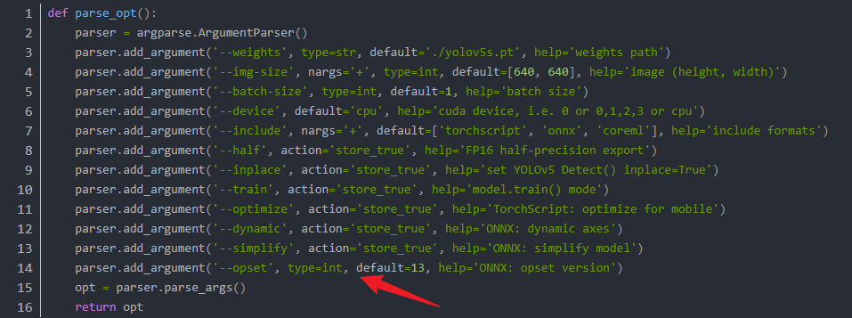
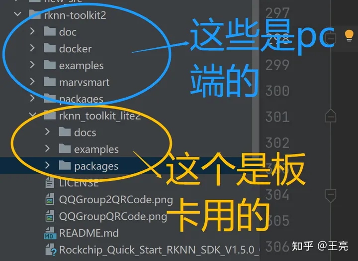

# 1.模型转换（pt-->rknn）

### 1.1将.pt文件转为.onnx文件（windows系统）

##### （1）安装相关依赖

配置好pytorch环境，cd到yolov5文件夹下，安装需求：

```
pip install -r requirements.txt
pip install onnx
```

##### （2）运行export.py

找到yolov5-5.0（台式机上）中的export.py，修改其中的权重位置

运行export.py即可。

##### （3）相关报错

**（1）报错：Inplace update to inference tensor outside Inference**

解决方法：进入以下文件

```
./utils/torch_utils.py
```

然后修改minmum:后面的torch版本（图中绿色数字），我当前环境的torch是1.9.0版本的，所以修改大于这个版本即可


<u>***（2）报错：Yolov5 ONNX: export failure: Unsupported ONNX opset version: 17***</u>

在export.py 中的 def parse_opt()函数修改：将--opset的default改为12



**（3）ImportError: DLL load failed while importing _imaging: 找不到指定的模块。**

卸载重装pillow包，重开pycharm

### 1.2 将.onnx文件转为.rknn文件(ubuntu x64系统)

##### （1）环境配置

直接用系统环境

```
sudo apt-get update
sudo apt-get install -y python3 python3-dev python3-pip gcc

sudo apt-get install -y python3-opencv
sudo apt-get install -y python3-numpy
```

##### （2）安装RKNN Toolkit Lite2

下载链接：

```
https://github.com/rockchip-linux/rknn-toolkit2
```



安装PC端的，进入rknn-toolkit2/packages文件夹下，使用以下指令安装：RKNN Toolkit Lite2

```
# Python 3.7
pip3 install rknn_toolkit_lite2-1.x.0-cp37-cp37m-linux_x86_64.whl
# Python 3.8
pip3 install rknn_toolkit_lite2-1.x.0-cp38-cp38-linux_x86_64.whl
# Python 3.9
pip3 install rknn_toolkit_lite2-1.x.0-cp39-cp39-linux_x86_64.whl
# Python 3.10
pip3 install rknn_toolkit_lite2-1.x.0-cp310-cp310-linux_x86_64.whl
```

##### （4）运行test.py（第1种方法）

进入以下文件夹：

```
rknn-toolkit2/examples/onnx/yolov5/
```

打开test.py，修改：

```
ONNX_MODEL   #输入
RKNN_MODEL   #输出
CLASSES      #改为自己数据集的类别
input_data.append(np.transpose(input0_data,(1,2,0,3)))  #修改为（2,3,0,1）
```

然后，打开终端，进入pytorch环境，输入：

```
python test.py
```

##### （5）运行onnx2rknn,py（第2种方法）

进入以下文件夹：

```
rknpu2/examples/rknn_yolov5_dem0/convert_rknn_demo/yolov5/
```

打开onnx2rknn.py修改：

```
platform = 'rk3588'
exp = 'new7'  #命名用的
MODEL_PATH = './onnx_models/new7.onnx' #.onnx文件的位置
```

然后，打开终端，进入pytorch环境，输入：

```
python onnx2rknn.py
```

结果保存在rknn_models文件夹下

# 2.遇到的问题

### 2.1 重叠框

##### （1）卸载pytorch

```
conda uninstall pytorch
```

##### （2）安装1.10.0以下版本的pytorch

```
conda install pytorch==1.9.1 torchvision==0.10.1 torchaudio==0.9.1 cudatoolkit=11.3 -c pytorch -c conda-forge
```

