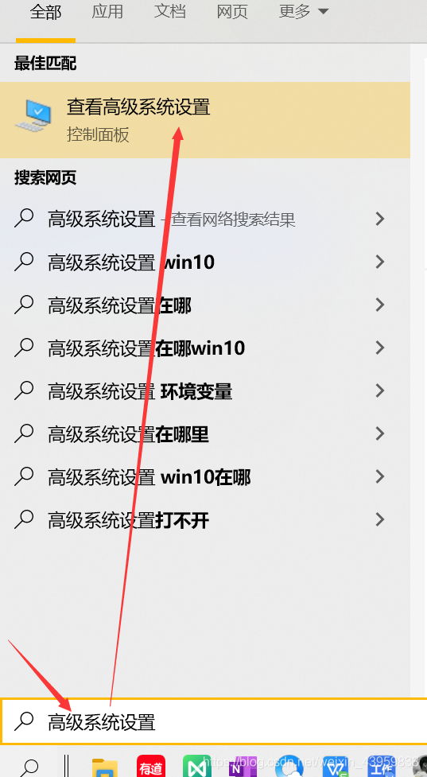
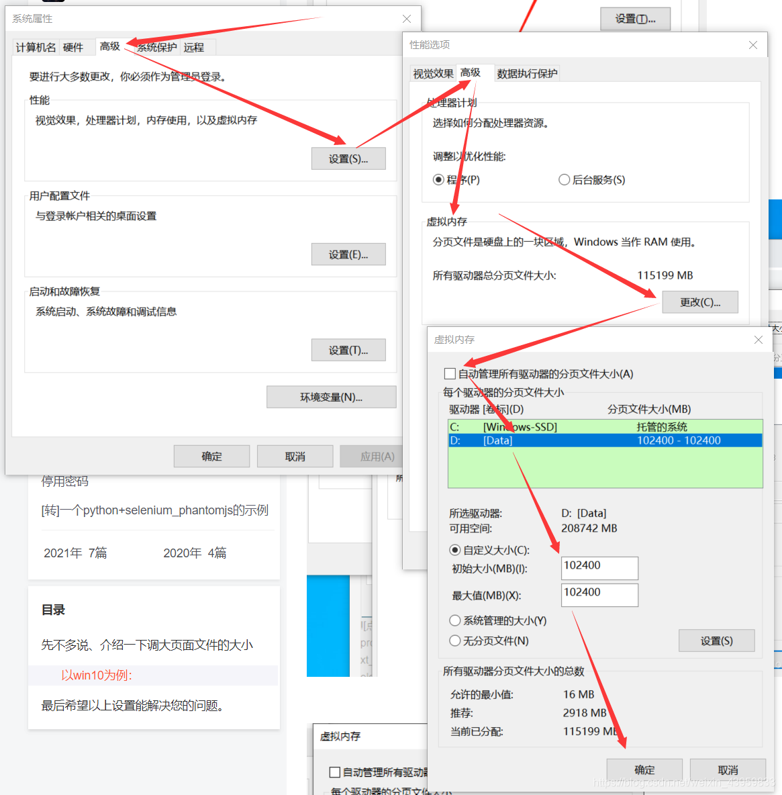

# 1.数据集训练全过程

### 1.1 视频数据处理

##### （1）逐帧导出视频图片

##### （2）按比例抽帧

```python
# 深度学习过程中，需要制作训练集和验证集、测试集。
import os, random, shutil

def moveFile(fileDir):
    pathDir = os.listdir(fileDir)  # 取图片的原始路径
    filenumber = len(pathDir)
    rate = 0.1  # 自定义抽取图片的比例，比方说100张抽10张，那就是0.1
    picknumber = int(filenumber * rate)  # 按照rate比例从文件夹中取一定数量图片
    sample = random.sample(pathDir, picknumber)  # 随机选取picknumber数量的样本图片
    print(sample)
    for name in sample:
        shutil.move(fileDir + name, tarDir + name)
    return

if __name__ == '__main__':
    fileDir = "E:/目标检测数据集/安阳数据采集/video_指控车_2024.3.7/"  # 源图片文件夹路径
    tarDir = 'C:/Users/33369/Desktop/安阳数据集/正例/指控车/'  # 移动到新的文件夹路径
    moveFile(fileDir)
```

##### （3）批量重命名

```python
# 按修改提示修改命名样式，样例中命名为：img_1
import os


def batch_rename_with_prefix(folder_path, prefix):
    # 获取文件夹中的所有文件
    files = os.listdir(folder_path)

    # 初始化计数器
    count = 1

    # 遍历文件夹中的所有文件
    for file_name in files:
        # 构建新文件名，例如：前缀_编号.扩展名
        new_file_name = f"{prefix}_{count}.{file_name.split('.')[-1]}" # 修改1

        # 构建文件的完整路径
        old_file_path = os.path.join(folder_path, file_name)
        new_file_path = os.path.join(folder_path, new_file_name)

        # 重命名文件
        os.rename(old_file_path, new_file_path)

        # 更新计数器
        count += 1


# 指定要批量编号的文件夹路径和前缀
folder_path = "D:/Code/python/datasets/shouchi/image"
prefix = "img"  # 修改2

# 调用函数进行批量编号并修改前缀
batch_rename_with_prefix(folder_path, prefix)

```


### 1.2数据集标注

##### （1）安装labelimg必要库

```python
conda activate pytorch

conda install pyqt
conda install pillow

conda install labelimg
```

##### （2）标注

激活环境后，输入labelimg命令打开

设置：图片文件夹输入路径、输出路径。标注格式选择：Pascall VOC

```
键盘上：
A和D:上一张、下一张
W：调出标注十字线
```


### 1.3数据集配置

##### （1）创建文件夹

```python
Annotations
images
Annotation_YOLO
labels
```

##### （2）xml文件转yolo格式(txt)

```python
# 注意：xml文件不要有中文路径（标注的时候不要放在中文路径下）
import xml.etree.ElementTree as ET
import os
from os import getcwd
import glob

# 1. 自己创建文件夹,例如：label_mal label_txt  也可以修改别的
image_set = 'Annotations'  # 需要转换的文件夹名称（文件夹内放xml标签文件）
imageset2 = 'labels'  # 保存txt的文件夹
# 2.换成你的类别 当前的顺序，就txt 0,1,2,3 四个类别
classes = ['tank', 'person', 'van']  # 标注时的标签 注意顺序一定不要错。
# 3.
# # 转换文件夹的绝对路径
# data_dir = 'D:/detectAuto_/data'
# 或者 读取当前路径
data_dir = getcwd()  # 当前路径

'''
xml中框的左上角坐标和右下角坐标(x1,y1,x2,y2)
》》txt中的中心点坐标和宽和高(x,y,w,h)，并且归一化
'''


def convert(size, box):
    dw = 1. / size[0]
    dh = 1. / size[1]
    x = (box[0] + box[1]) / 2.0
    y = (box[2] + box[3]) / 2.0
    w = box[1] - box[0]
    h = box[3] - box[2]
    x = x * dw
    w = w * dw
    y = y * dh
    h = h * dh
    return (x, y, w, h)


def convert_annotation(data_dir, imageset1, imageset2, image_id):
    in_file = open(data_dir + '/%s/%s.xml' % (imageset1, image_id))  # 读取xml
    out_file = open(data_dir + '/%s/%s.txt' % (imageset2, image_id), 'w')  # 保存txt

    tree = ET.parse(in_file)
    root = tree.getroot()
    size = root.find('size')
    w = int(size.find('width').text)
    h = int(size.find('height').text)
    for obj in root.iter('object'):
        difficult = obj.find('difficult').text
        cls = obj.find('name').text
        if cls not in classes or int(difficult) == 1:
            continue
        cls_id = classes.index(cls)  # 获取类别索引
        xmlbox = obj.find('bndbox')
        b = (float(xmlbox.find('xmin').text), float(xmlbox.find('xmax').text), float(xmlbox.find('ymin').text),
             float(xmlbox.find('ymax').text))
        bb = convert((w, h), b)
        out_file.write(str(cls_id) + " " + " ".join([str('%.6f' % a) for a in bb]) + '\n')


image_ids = []
for x in glob.glob(data_dir + '/%s' % image_set + '/*.xml'):
    image_ids.append(os.path.basename(x)[:-4])
print('\n%s数量:' % image_set, len(image_ids))  # 确认数量
i = 0
for image_id in image_ids:
    i = i + 1
    convert_annotation(data_dir, image_set, imageset2, image_id)
    print("%s 数据:%s/%s文件完成！" % (image_set, i, len(image_ids)))

print("Done!!!")

```

**如果不小心在中文路径下标注，可以：**

```python
import os
def replace_in_xml_folder(folder_path, search_str, replace_str):
    # 遍历指定文件夹下所有文件
    for root, dirs, files in os.walk(folder_path):
        for file_name in files:
            if file_name.endswith('.xml'):
                file_path = os.path.join(root, file_name)
                # 读取XML文件内容
                with open(file_path, 'r', encoding='utf-8') as file:
                    xml_content = file.read()
                # 替换字符串并写回文件
                updated_content = xml_content.replace(search_str, replace_str)
                with open(file_path, 'w', encoding='utf-8') as file:
                    file.write(updated_content)
# 调用函数，将指定文件夹下所有XML文件中的字符替换为目标字符
replace_in_xml_folder('D:/Code/python/yolov5-5.0/datasets/test', '微信', 'aaa')
```

##### （3）分割数据集

将数据集分割为：train、test、val三部分

```python
# sklearn.model_selection在pycharm里安装
import os, shutil
from sklearn.model_selection import train_test_split

val_size = 0.1
test_size = 0.2
postfix = 'jpg'
imgpath = 'images'
txtpath = 'Annotations_YOLO'

os.makedirs('images/train', exist_ok=True)
os.makedirs('images/val', exist_ok=True)
os.makedirs('images/test', exist_ok=True)
os.makedirs('labels/train', exist_ok=True)
os.makedirs('labels/val', exist_ok=True)
os.makedirs('labels/test', exist_ok=True)

listdir = [i for i in os.listdir(txtpath) if 'txt' in i]
train, test = train_test_split(listdir, test_size=test_size, shuffle=True, random_state=0)
train, val = train_test_split(train, test_size=val_size, shuffle=True, random_state=0)
print(f'train set size:{len(train)} val set size:{len(val)} test set size:{len(test)}')

for i in train:
    shutil.copy('{}/{}.{}'.format(imgpath, i[:-4], postfix), 'images/train/{}.{}'.format(i[:-4], postfix))
    shutil.copy('{}/{}'.format(txtpath, i), 'labels/train/{}'.format(i))

for i in val:
    shutil.copy('{}/{}.{}'.format(imgpath, i[:-4], postfix), 'images/val/{}.{}'.format(i[:-4], postfix))
    shutil.copy('{}/{}'.format(txtpath, i), 'labels/val/{}'.format(i))

for i in test:
    shutil.copy('{}/{}.{}'.format(imgpath, i[:-4], postfix), 'images/test/{}.{}'.format(i[:-4], postfix))
    shutil.copy('{}/{}'.format(txtpath, i), 'labels/test/{}'.format(i))

```

##### （4）配置数据集

将数据集按以下方式进行配置：

```python
train:
	images
    labels
test:
	images
    labels
val:
	images
    labels
```


### 1.4 PC端训练

##### （1）制作数据集配置文件

```python
# mydata.yaml
train: D:/Code/python/yolov5-5.0/datasets/YX/train/
val: D:/Code/python/yolov5-5.0/datasets/YX/val/
test: DD:/Code/python/yolov5-5.0/datasets/YX/test/

# number of classes
nc: 3

# class names
names: ["tank","person","van"]
```

##### （2）修改train.py相关参数配置

```python
# 初始权重，一般为yolov5n/s/m/l/x.pt等官方权重
parser.add_argument('--weights', type=str, default='yolov5s.pt', help='initial weights path')
# 初始权重的配置文件路径，改算法结构可以在这个配置文件里改
parser.add_argument('--cfg', type=str, default='models/yolov5s.yaml', help='model.yaml path')
# 自己数据集的配置文件路径
parser.add_argument('--data', type=str, default='data/myYX.yaml', help='data.yaml path')
# 训练批次：电脑同时计算的次数
parser.add_argument('--batch-size', type=int, default=2, help='total batch size for all GPUs')
# 图片尺寸：会自动将数据集图片切割为640*640尺寸的
parser.add_argument('--img-size', nargs='+', type=int, default=[640, 640], help='[train, test] image sizes')
```

##### （3）运行train.py

```
在终端或者pycharm里运行train.py
```


## 2.常见error

#### （1）numpy版本问题

##### 报错内容：

AttributeError: module 'numpy' has no attribute 'int'. `np.int` was a deprecated alias for the builtin `int`. To avoid this error in existing code, use `int` by itself. Doing this will not modify any behavior and is safe. When replacing `np.int`, you may wish to use e.g. `np.int64` or `np.int32` to specify the precision. If you wish to review your current use, check the release note link for additional information. The aliases was originally deprecated in NumPy 1.20; for more details and guidance see the original release note at:

##### 报错原因：

numpy的版本太新

##### 解决方法：

安装1.20.3版本的numpy

```python
pip uninstall numpy
pip install numpy==1.20.3
```

#### （2）loss.py报错

##### 报错内容：

RuntimeError: result type Float can't be cast to the desired output type __int64

##### 报错原因：

新版本的torch无法自动执行此转换，旧版本torch可以。

##### 解决方法：

将loss.py中的：

```python
gain = torch.ones(7, device=targets.device)
```

改为：

```python
gain = torch.ones(7, device=targets.device).long()
```

#### （3）未分配虚拟内存

##### 报错内容：

OSError: [WinError 1455] 页面文件太小，无法完成操作

##### 报错原因：

电脑默认情况下是没有给D盘分配虚拟内存的, 所以将Python装在D盘的朋友, 在跑程序时, 没有分配虚拟内存, 自然就遇到了上面的问题。

##### 解决方法：

给D盘分配虚拟内存即可.(如果Python安装在C盘, 就更改C盘的虚拟内存的值, 调大点)





### 

#### （4）Index Error: list index out of range

##### 报错原因

数据集的配置不正确，导致程序不能找到图像或者标签

##### 解决方法

将数据集改为下图的形式：


然后在myVisDrone.yaml配置文件中修改3个路径，如：

train: D:/Code/python/ultralytics-main/ultralytics/datasets/VisDrone/train

