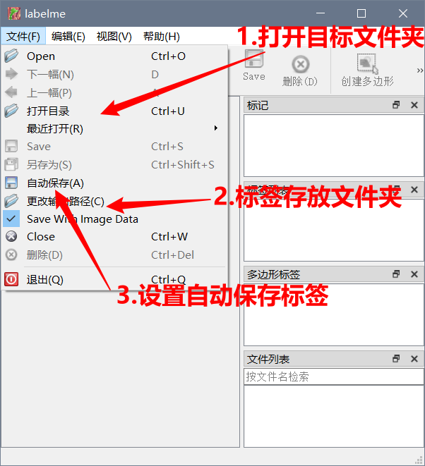
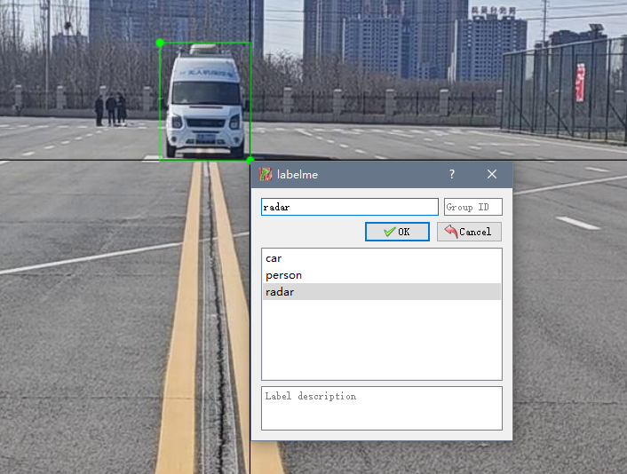
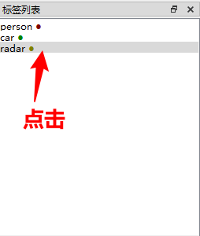

### 1.labelme的使用

##### （1）安装必要的库

```
conda activate pytorch

conda install pyqt
conda install pillow

conda install labelme=3.16.2
#conda 安装命令如果出错也可以使用 pip 命令，使用逻辑等号"=="
pip install labelme==3.16.2
```

##### （2）使用

激活环境后，输入labelme命令打开

```
键盘上：
D：下一张
A：上一张
```



##### （3）图片标注示例

点击 打开目录，选择待标注图片所在文件夹，批量导入

- 点击编辑，根据需求，选择圆、矩形、多边形（默认）等开始标注，一般为矩形

- 一个区域标注完成后，会自动弹出对话框，键入标签名称

  

##### （4）标签列表

例如：点击radar这个标签，下次标注之后，弹出的对话框标签默认为radar

