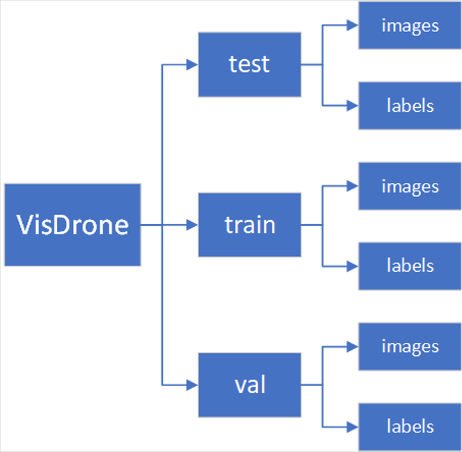

# 1.数据集配置

### 1.1 VOC格式数据集（.xml）

##### （1）存放图片和标签

将图片和标签分别存放在Annotations和images文件夹下，总文件夹为data

##### （2）按比例划分数据集

```
import os
import random

trainval_percent = 0.9
train_percent = 0.9
xmlfilepath = 'data/Annotations'
txtsavepath = 'data/ImageSets'
total_xml = os.listdir(xmlfilepath)

num = len(total_xml)
list = range(num)
tv = int(num * trainval_percent)
tr = int(tv * train_percent)
trainval = random.sample(list, tv)
train = random.sample(trainval, tr)

ftrainval = open('data/ImageSets/trainval.txt', 'w')
ftest = open('data/ImageSets/test.txt', 'w')
ftrain = open('data/ImageSets/train.txt', 'w')
fval = open('data/ImageSets/val.txt', 'w')

for i in list:
    name = total_xml[i][:-4] + '\n'
    if i in trainval:
        ftrainval.write(name)
        if i in train:
            ftrain.write(name)
        else:
            fval.write(name)
    else:
        ftest.write(name)

ftrainval.close()
ftrain.close()
fval.close()
ftest.close()

```

##### （3）将xml文件转换为yolo格式的txt文件

```
# -*- coding: utf-8 -*-
# xml解析包
import xml.etree.ElementTree as ET
import pickle
import os
from os import listdir, getcwd
from os.path import join


sets = ['train', 'test', 'val']
classes = ['fall']


# 进行归一化操作
def convert(size, box): # size:(原图w,原图h) , box:(xmin,xmax,ymin,ymax)
    dw = 1./size[0]     # 1/w
    dh = 1./size[1]     # 1/h
    x = (box[0] + box[1])/2.0   # 物体在图中的中心点x坐标
    y = (box[2] + box[3])/2.0   # 物体在图中的中心点y坐标
    w = box[1] - box[0]         # 物体实际像素宽度
    h = box[3] - box[2]         # 物体实际像素高度
    x = x*dw    # 物体中心点x的坐标比(相当于 x/原图w)
    w = w*dw    # 物体宽度的宽度比(相当于 w/原图w)
    y = y*dh    # 物体中心点y的坐标比(相当于 y/原图h)
    h = h*dh    # 物体宽度的宽度比(相当于 h/原图h)
    return (x, y, w, h)    # 返回 相对于原图的物体中心点的x坐标比,y坐标比,宽度比,高度比,取值范围[0-1]


# year ='2012', 对应图片的id（文件名）
def convert_annotation(image_id):
    '''
    将对应文件名的xml文件转化为label文件，xml文件包含了对应的bunding框以及图片长款大小等信息，
    通过对其解析，然后进行归一化最终读到label文件中去，也就是说
    一张图片文件对应一个xml文件，然后通过解析和归一化，能够将对应的信息保存到唯一一个label文件中去
    labal文件中的格式：calss x y w h　　同时，一张图片对应的类别有多个，所以对应的ｂｕｎｄｉｎｇ的信息也有多个
    '''
    # 对应的通过year 找到相应的文件夹，并且打开相应image_id的xml文件，其对应bund文件
    in_file = open('data/Annotations/%s.xml' % (image_id), encoding='utf-8')
    # 准备在对应的image_id 中写入对应的label，分别为
    # <object-class> <x> <y> <width> <height>
    out_file = open('data/labels/%s.txt' % (image_id), 'w', encoding='utf-8')
    # 解析xml文件
    tree = ET.parse(in_file)
    # 获得对应的键值对
    root = tree.getroot()
    # 获得图片的尺寸大小
    size = root.find('size')
    # 如果xml内的标记为空，增加判断条件
    if size != None:
        # 获得宽
        w = int(size.find('width').text)
        # 获得高
        h = int(size.find('height').text)
        # 遍历目标obj
        for obj in root.iter('object'):
            # 获得difficult ？？
            difficult = obj.find('difficult').text
            # 获得类别 =string 类型
            cls = obj.find('name').text
            # 如果类别不是对应在我们预定好的class文件中，或difficult==1则跳过
            if cls not in classes or int(difficult) == 1:
                continue
            # 通过类别名称找到id
            cls_id = classes.index(cls)
            # 找到bndbox 对象
            xmlbox = obj.find('bndbox')
            # 获取对应的bndbox的数组 = ['xmin','xmax','ymin','ymax']
            b = (float(xmlbox.find('xmin').text), float(xmlbox.find('xmax').text), float(xmlbox.find('ymin').text),
                 float(xmlbox.find('ymax').text))
            print(image_id, cls, b)
            # 带入进行归一化操作
            # w = 宽, h = 高， b= bndbox的数组 = ['xmin','xmax','ymin','ymax']
            bb = convert((w, h), b)
            # bb 对应的是归一化后的(x,y,w,h)
            # 生成 calss x y w h 在label文件中
            out_file.write(str(cls_id) + " " + " ".join([str(a) for a in bb]) + '\n')


# 返回当前工作目录
wd = getcwd()
print(wd)


for image_set in sets:
    '''
    对所有的文件数据集进行遍历
    做了两个工作：
　　　　１．将所有图片文件都遍历一遍，并且将其所有的全路径都写在对应的txt文件中去，方便定位
　　　　２．同时对所有的图片文件进行解析和转化，将其对应的bundingbox 以及类别的信息全部解析写到label 文件中去
    　　　　　最后再通过直接读取文件，就能找到对应的label 信息
    '''
    # 先找labels文件夹如果不存在则创建
    if not os.path.exists('data/labels/'):
        os.makedirs('data/labels/')
    # 读取在ImageSets/Main 中的train、test..等文件的内容
    # 包含对应的文件名称
    image_ids = open('data/ImageSets/%s.txt' % (image_set)).read().strip().split()
    # 打开对应的2012_train.txt 文件对其进行写入准备
    list_file = open('data/%s.txt' % (image_set), 'w')
    # 将对应的文件_id以及全路径写进去并换行
    for image_id in image_ids:
        list_file.write('data/images/%s.jpg\n' % (image_id))
        # 调用  year = 年份  image_id = 对应的文件名_id
        convert_annotation(image_id)
    # 关闭文件
    list_file.close()

```

##### （4）配置文件夹格式


将数据集文件夹改为上述格式。

##### （5）修改.yaml配置文件

如下所示：

```
train: D:/Code/python/ultralytics-main/ultralytics/datasets/VisDrone/train
val: D:/Code/python/ultralytics-main/ultralytics/datasets/VisDrone/val
test: D:/Code/python/ultralytics-main/ultralytics/datasets/VisDrone/test

# number of classes
nc: 10

# class names
names: ["pedestrian","people","bicycle","car","van","truck","tricycle","awning-tricycle","bus","motor"]
```

### 1.2yolo格式数据集（.txt）

先将yolo转voc，再由voc转yolo.

##### （1）yolo转voc的代码

```
from xml.dom.minidom import Document
import os
import cv2
 
 
# def makexml(txtPath, xmlPath, picPath):  # txt所在文件夹路径，xml文件保存路径，图片所在文件夹路径
def makexml(picPath, txtPath, xmlPath):  # txt所在文件夹路径，xml文件保存路径，图片所在文件夹路径
    """此函数用于将yolo格式txt标注文件转换为voc格式xml标注文件
    在自己的标注图片文件夹下建三个子文件夹，分别命名为picture、txt、xml
    """
    dic = {'0': "pedestrian",  # 创建字典用来对类型进行转换
           '1': "people",  # 此处的字典要与自己的classes.txt文件中的类对应，且顺序要一致
           '2': "bicycle",
           '3': "car",
           '4': "van",
           '5': "truck",
           '6': "tricycle",
           '7': "awning-tricycle",
           '8': "bus",
           '9': "motor",
           }
    files = os.listdir(txtPath)
    for i, name in enumerate(files):
        xmlBuilder = Document()
        annotation = xmlBuilder.createElement("annotation")  # 创建annotation标签
        xmlBuilder.appendChild(annotation)
        txtFile = open(txtPath + name)
        txtList = txtFile.readlines()
        img = cv2.imread(picPath + name[0:-4] + ".jpg")
        Pheight, Pwidth, Pdepth = img.shape
 
        folder = xmlBuilder.createElement("folder")  # folder标签
        foldercontent = xmlBuilder.createTextNode("driving_annotation_dataset")
        folder.appendChild(foldercontent)
        annotation.appendChild(folder)  # folder标签结束
 
        filename = xmlBuilder.createElement("filename")  # filename标签
        filenamecontent = xmlBuilder.createTextNode(name[0:-4] + ".jpg")
        filename.appendChild(filenamecontent)
        annotation.appendChild(filename)  # filename标签结束
 
        size = xmlBuilder.createElement("size")  # size标签
        width = xmlBuilder.createElement("width")  # size子标签width
        widthcontent = xmlBuilder.createTextNode(str(Pwidth))
        width.appendChild(widthcontent)
        size.appendChild(width)  # size子标签width结束
 
        height = xmlBuilder.createElement("height")  # size子标签height
        heightcontent = xmlBuilder.createTextNode(str(Pheight))
        height.appendChild(heightcontent)
        size.appendChild(height)  # size子标签height结束
 
        depth = xmlBuilder.createElement("depth")  # size子标签depth
        depthcontent = xmlBuilder.createTextNode(str(Pdepth))
        depth.appendChild(depthcontent)
        size.appendChild(depth)  # size子标签depth结束
 
        annotation.appendChild(size)  # size标签结束
 
        for j in txtList:
            oneline = j.strip().split(" ")
            object = xmlBuilder.createElement("object")  # object 标签
            picname = xmlBuilder.createElement("name")  # name标签
            namecontent = xmlBuilder.createTextNode(dic[oneline[0]])
            picname.appendChild(namecontent)
            object.appendChild(picname)  # name标签结束
 
            pose = xmlBuilder.createElement("pose")  # pose标签
            posecontent = xmlBuilder.createTextNode("Unspecified")
            pose.appendChild(posecontent)
            object.appendChild(pose)  # pose标签结束
 
            truncated = xmlBuilder.createElement("truncated")  # truncated标签
            truncatedContent = xmlBuilder.createTextNode("0")
            truncated.appendChild(truncatedContent)
            object.appendChild(truncated)  # truncated标签结束
 
            difficult = xmlBuilder.createElement("difficult")  # difficult标签
            difficultcontent = xmlBuilder.createTextNode("0")
            difficult.appendChild(difficultcontent)
            object.appendChild(difficult)  # difficult标签结束
 
            bndbox = xmlBuilder.createElement("bndbox")  # bndbox标签
            xmin = xmlBuilder.createElement("xmin")  # xmin标签
            mathData = int(((float(oneline[1])) * Pwidth + 1) - (float(oneline[3])) * 0.5 * Pwidth)
            xminContent = xmlBuilder.createTextNode(str(mathData))
            xmin.appendChild(xminContent)
            bndbox.appendChild(xmin)  # xmin标签结束
 
            ymin = xmlBuilder.createElement("ymin")  # ymin标签
            mathData = int(((float(oneline[2])) * Pheight + 1) - (float(oneline[4])) * 0.5 * Pheight)
            yminContent = xmlBuilder.createTextNode(str(mathData))
            ymin.appendChild(yminContent)
            bndbox.appendChild(ymin)  # ymin标签结束
 
            xmax = xmlBuilder.createElement("xmax")  # xmax标签
            mathData = int(((float(oneline[1])) * Pwidth + 1) + (float(oneline[3])) * 0.5 * Pwidth)
            xmaxContent = xmlBuilder.createTextNode(str(mathData))
            xmax.appendChild(xmaxContent)
            bndbox.appendChild(xmax)  # xmax标签结束
 
            ymax = xmlBuilder.createElement("ymax")  # ymax标签
            mathData = int(((float(oneline[2])) * Pheight + 1) + (float(oneline[4])) * 0.5 * Pheight)
            ymaxContent = xmlBuilder.createTextNode(str(mathData))
            ymax.appendChild(ymaxContent)
            bndbox.appendChild(ymax)  # ymax标签结束
 
            object.appendChild(bndbox)  # bndbox标签结束
 
            annotation.appendChild(object)  # object标签结束
 
        f = open(xmlPath + name[0:-4] + ".xml", 'w')
        xmlBuilder.writexml(f, indent='\t', newl='\n', addindent='\t', encoding='utf-8')
        f.close()
 
if __name__ == "__main__":
    picPath = "VOCdevkit/VOC2007/JPEGImages/"  # 图片所在文件夹路径，后面的/一定要带上
    txtPath = "VOCdevkit/VOC2007/YOLO/"  # txt所在文件夹路径，后面的/一定要带上
    xmlPath = "VOCdevkit/VOC2007/Annotations/"  # xml文件保存路径，后面的/一定要带上
    makexml(picPath, txtPath, xmlPath)
```

##### （2）转为txt格式

同上

### 1.3通用的划分法

```
import xml.etree.ElementTree as ET
import os, cv2
import numpy as np
from os import listdir
from os.path import join
 
classes = ["pedestrian","people","bicycle","car","van","truck","tricycle","awning-tricycle","bus","motor"]
 
 
def convert(size, box):
    dw = 1. / (size[0])
    dh = 1. / (size[1])
    x = (box[0] + box[1]) / 2.0 - 1
    y = (box[2] + box[3]) / 2.0 - 1
    w = box[1] - box[0]
    h = box[3] - box[2]
    x = x * dw
    w = w * dw
    y = y * dh
    h = h * dh
    return (x, y, w, h)
 
 
def convert_annotation(xmlpath, xmlname):
    with open(xmlpath, "r", encoding='utf-8') as in_file:
        txtname = xmlname[:-4] + '.txt'
        txtfile = os.path.join(txtpath, txtname)
        tree = ET.parse(in_file)
        root = tree.getroot()
        filename = root.find('filename')
        img = cv2.imdecode(np.fromfile('{}/{}.{}'.format(imgpath, xmlname[:-4], postfix), np.uint8), cv2.IMREAD_COLOR)
        h, w = img.shape[:2]
        res = []
        for obj in root.iter('object'):
            cls = obj.find('name').text
            if cls not in classes:
                classes.append(cls)
            cls_id = classes.index(cls)
            xmlbox = obj.find('bndbox')
            b = (float(xmlbox.find('xmin').text), float(xmlbox.find('xmax').text), float(xmlbox.find('ymin').text),
                 float(xmlbox.find('ymax').text))
            bb = convert((w, h), b)
            res.append(str(cls_id) + " " + " ".join([str(a) for a in bb]))
        if len(res) != 0:
            with open(txtfile, 'w+') as f:
                f.write('\n'.join(res))
 
 
if __name__ == "__main__":
    postfix = 'png'   #图片格式，我的是png
    imgpath = 'VOCdevkit/JPEGImages'
    xmlpath = 'VOCdevkit/Annotations'
    txtpath = 'VOCdevkit/txt'
 
    if not os.path.exists(txtpath):
        os.makedirs(txtpath, exist_ok=True)
 
    list = os.listdir(xmlpath)
    error_file_list = []
    for i in range(0, len(list)):
        try:
            path = os.path.join(xmlpath, list[i])
            if ('.xml' in path) or ('.XML' in path):
                convert_annotation(path, list[i])
                print(f'file {list[i]} convert success.')
            else:
                print(f'file {list[i]} is not xml format.')
        except Exception as e:
            print(f'file {list[i]} convert error.')
            print(f'error message:\n{e}')
            error_file_list.append(list[i])
    print(f'this file convert failure\n{error_file_list}')
    print(f'Dataset Classes:{classes}')
```

# 2.数据集配置常见bug

### 2.1Index Error: list index out of range

##### （1）报错原因

数据集的配置不正确，导致程序不能找到图像或者标签

##### （2）解决方法

将数据集改为下图的形式：



然后在myVisDrone.yaml配置文件中修改3个路径，如：

train: D:/Code/python/ultralytics-main/ultralytics/datasets/VisDrone/train
