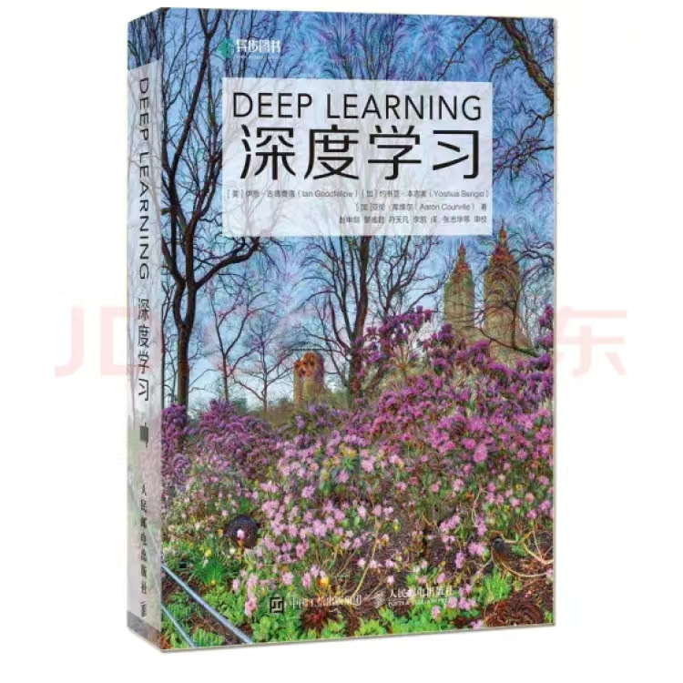
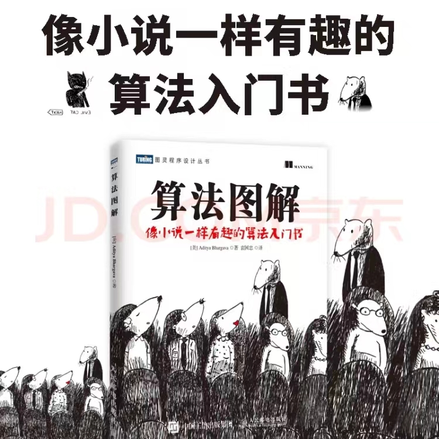
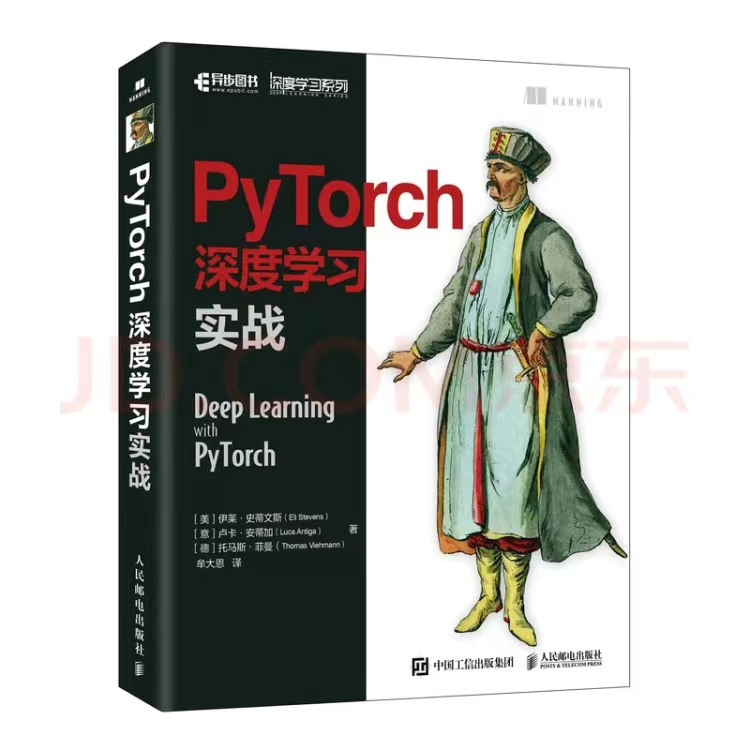

### 1.学习语言

##### （1）python

python语言必须掌握，因为很多深度学习代码是用python写的，python使用起来比较方便，有大量的库，调用起来比较方便。

推荐课程：黑马程序员python

参考网址：

```
https://www.bilibili.com/video/BV1qW4y1a7fU/?spm_id_from=333.337.search-card.all.click&vd_source=dd5d84af5454208215764bd38355c767
```

```
https://www.bilibili.com/video/BV1ex411x7Em/?spm_id_from=333.337.search-card.all.click&vd_source=dd5d84af5454208215764bd38355c767
```

##### （2）c++

学有余力可以尝试用c++写深度学习代码，一些github上的深度学习代码是用c++写的。好处是：轻量级，而且c++更易部署到开发板上。

推荐课程：黑马程序员c++

参考网址：

```
https://www.bilibili.com/video/BV1et411b73Z/?spm_id_from=333.337.search-card.all.click&vd_source=dd5d84af5454208215764bd38355c767
```

### 2.基础课程

##### （1）边缘检测

目标检测、分割课程，有助于理解深度学习中的python代码

参考网址：

```
https://www.bilibili.com/video/BV1kv4y1J784/?spm_id_from=333.999.0.0&vd_source=dd5d84af5454208215764bd38355c767
```

##### （2）机器学习

推荐课程：吴恩达机器学习

参考网址：

```
https://www.bilibili.com/video/BV16C4y197St/?spm_id_from=333.337.search-card.all.click&vd_source=dd5d84af5454208215764bd38355c767
```

##### （3）深度学习

推荐课程：吴恩达深度学习

参考网址：

```
https://www.bilibili.com/video/BV16C4y197St/?spm_id_from=333.337.search-card.all.click&vd_source=dd5d84af5454208215764bd38355c767
```


### 3.算法

##### （1）yolov5

```
https://www.bilibili.com/video/BV1Dt4y1x7Fz?p=1&vd_source=dd5d84af5454208215764bd38355c767
```

##### （2）yolov8

```
https://www.bilibili.com/video/BV1ER4y1z7co/?spm_id_from=333.337.search-card.all.click&vd_source=dd5d84af5454208215764bd38355c767
```

### 4.推荐书籍

##### （1）深度学习（花书）



##### （2）算法图解



##### （3）pytorch深度学习实战


