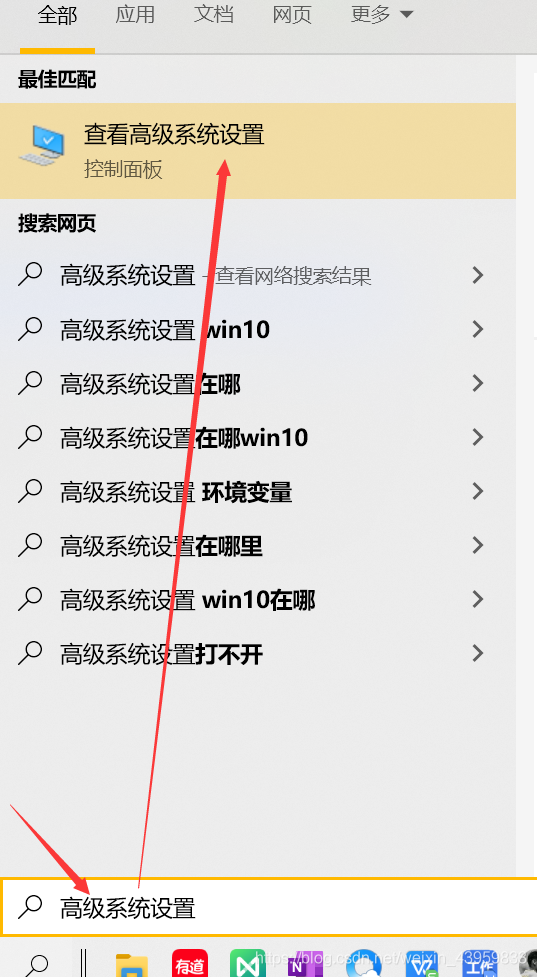
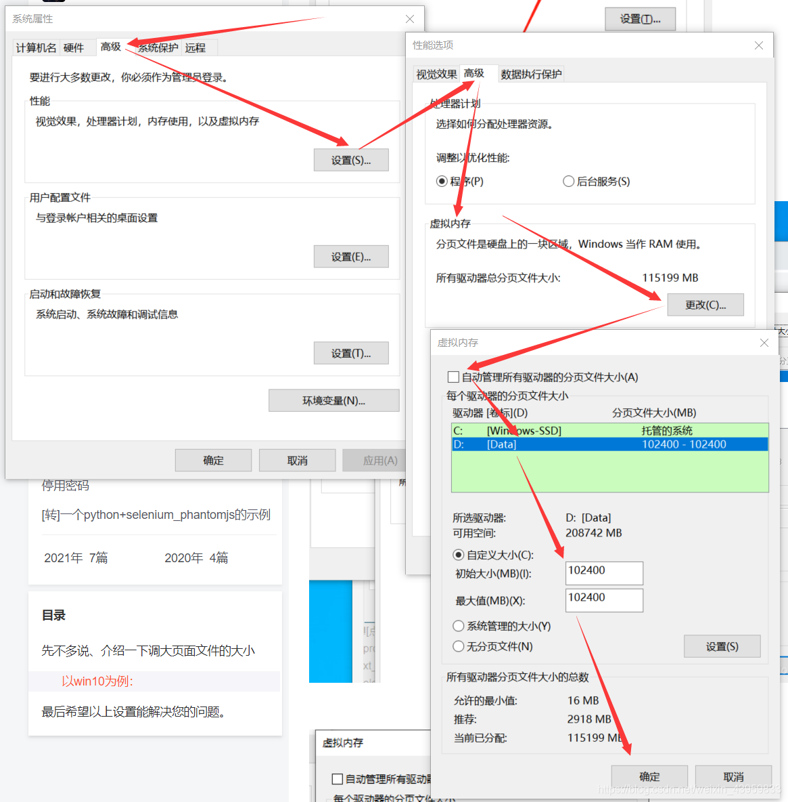

#### 1.conda install无法安装安装，提示 CondaSSLError: OpenSSL appears to be unavailable on this machine. OpenSSL is

##### （1） 找到你的anaconda的安装目录位置：比如 D:\ProgramData\Anaconda3\Library\bin，找到如下两个DLL的文件：

libcrypto-1_1-x64.dll

libssl-1_1-x64.dll


##### （2）复制到 D:\ProgramData\Anaconda3\DLLs


##### （3）重启终端

#### 2.AttributeError: module 'numpy' has no attribute 'int'. `np.int` was a deprecated alias for the builtin `int`. To avoid this error in existing code, use `int` by itself. Doing this will not modify any behavior and is safe. When replacing `np.int`, you may wish to use e.g. `np.int64` or `np.int32` to specify 

##### 问题原因：

新版本的numpy里面没有np.int了。

##### 解决方法

降低[numpy版本](https://so.csdn.net/so/search?q=numpy版本&spm=1001.2101.3001.7020)，安装1.20以下的版本。

```
pip uninstall numpy

pip install numpy==1.19.0

```

#### 3.OSError: [WinError 1455] 页面文件太小，无法完成操作

电脑默认情况下是没有给D盘分配虚拟内存的, 所以将Python装在D盘的朋友, 在跑程序时, 没有分配虚拟内存, 自然就遇到了上面的问题, 所以根本操作只要给D盘分配虚拟内存即可.(如果Python安装在C盘, 就更改C盘的虚拟内存的值, 调大点)




