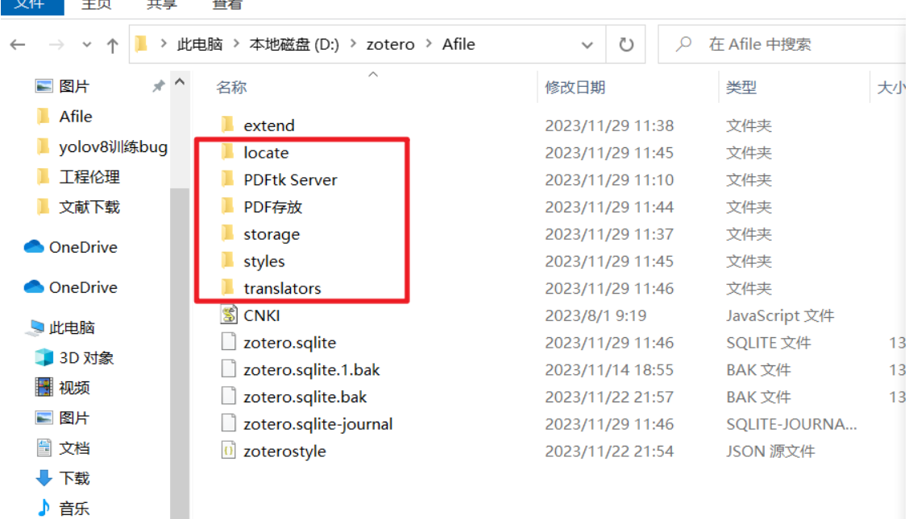
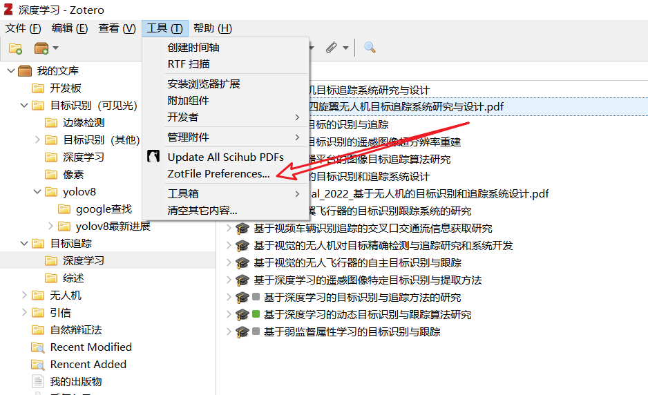
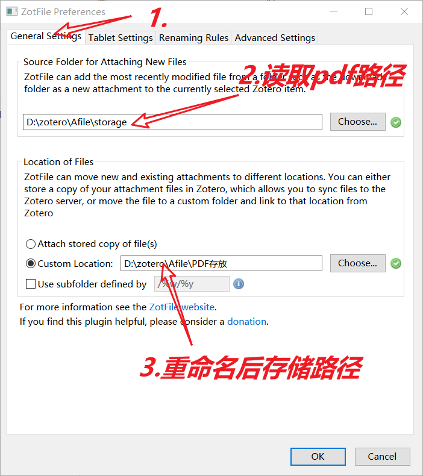
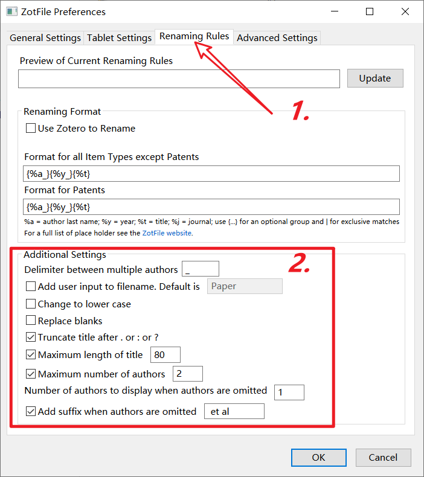
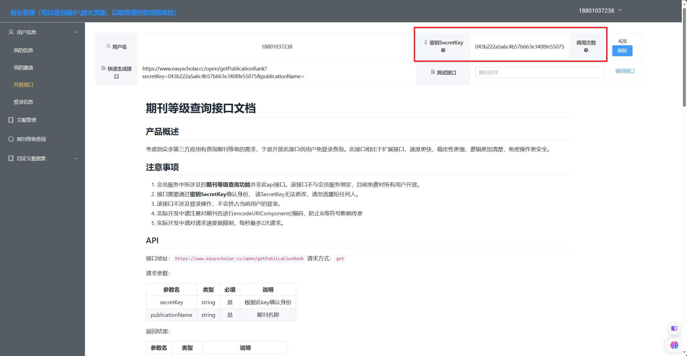
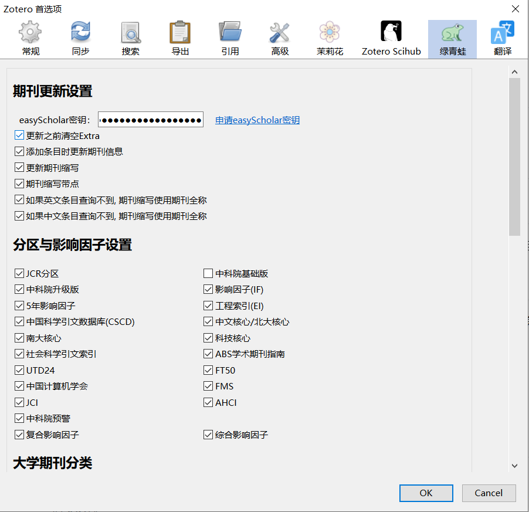
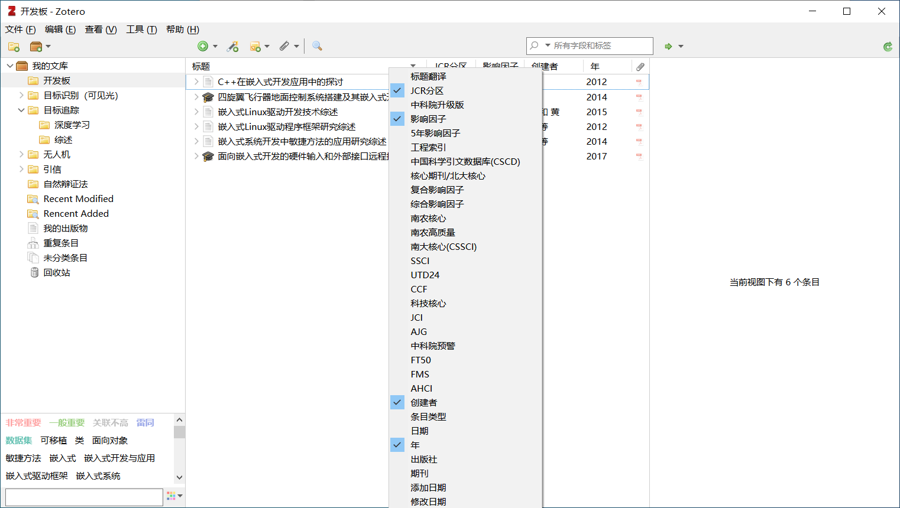
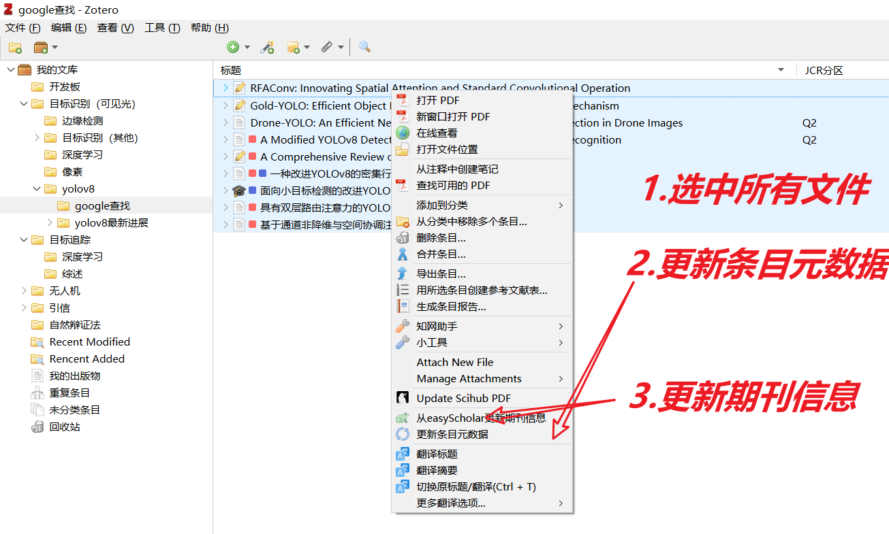

# 1.将旧文件转移到新电脑上

（1）将旧文件夹直接复制到新电脑上

（2）注意目录路径最好设置的跟旧电脑一样

（3）拔掉U盘

# 2.zotero安装的插件

## 2.1 Jasminum

## 2.2 ZotFile

（1）点击工具-->zotfile preference -->

（2）修改读取pdf的路径和重命名后存储的路径

（3）设置重命名规则

## 2.3 Sci-Hub Plugin for Zotero

## 2.4 Zotero PDF Translate

## 2.5 zotero-updateifs

注意版本对应好，最新版仅支持Zotero 7.0, Zotero 6.0请下载[0.13.0](https://github.com/redleafnew/zotero-updateifsE/releases/tag/0.13.0)。

### 2.5.1easyScholar密钥

（1）打开edge浏览器easyScholar插件网站登录

（2）点击：我的信息-->开放接口-->复制密钥-->粘贴到zorero的首选项配置上

（3）在首选项中，该打钩的打钩

（4）在标题右键选择影响因子、JCR分区、作者、年等

（5）更新期刊信息

选中所有文件，右键

