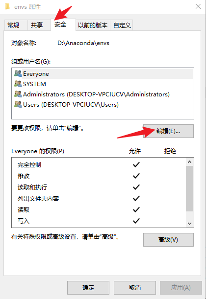
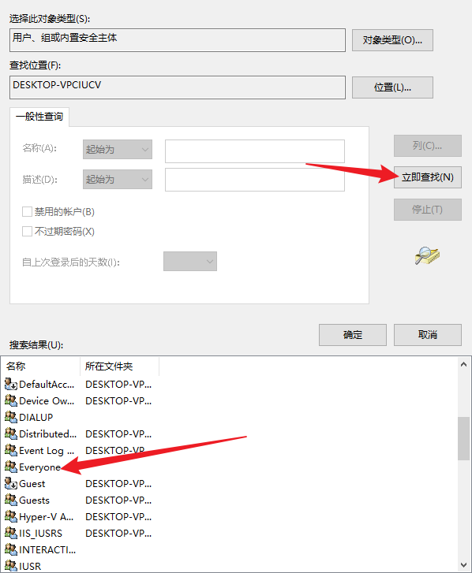
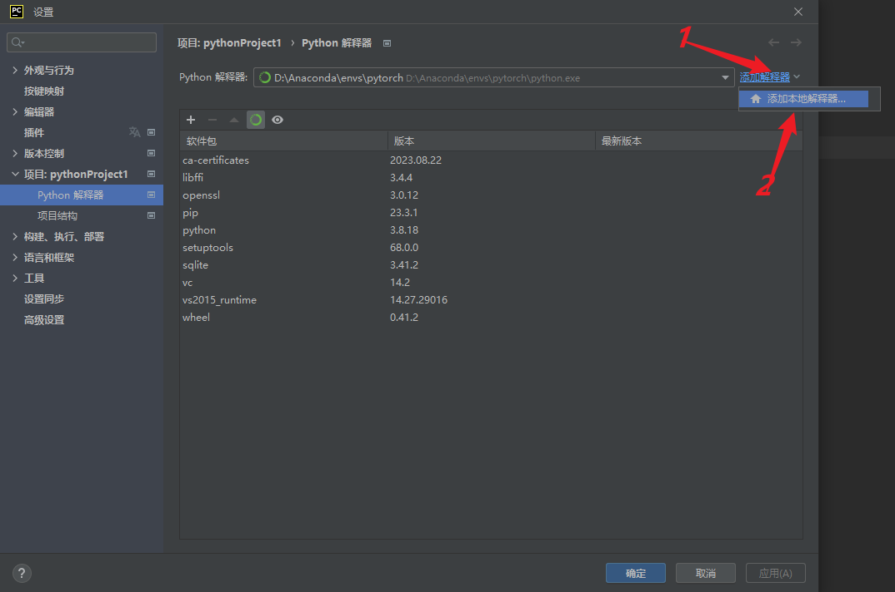
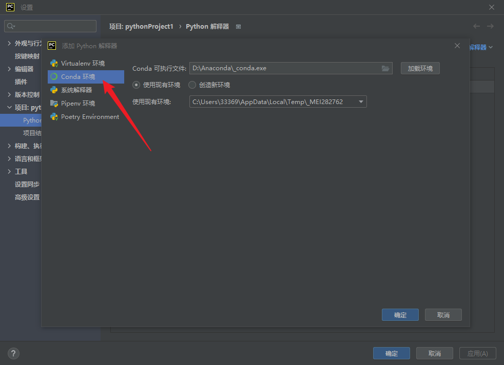
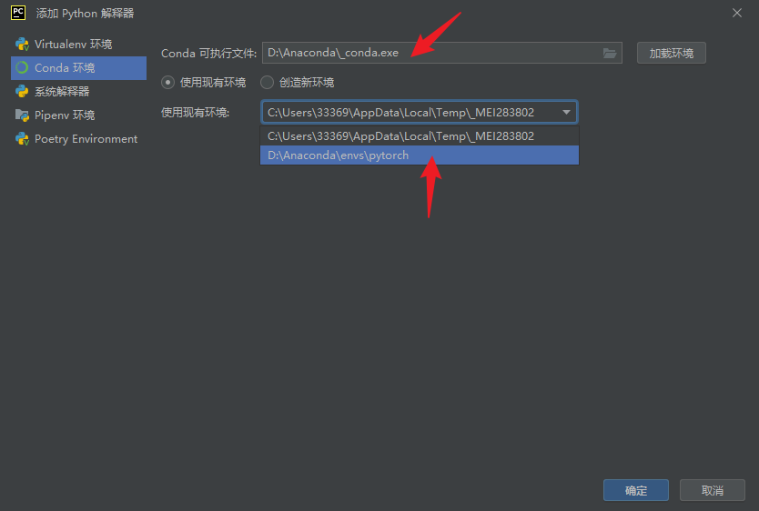
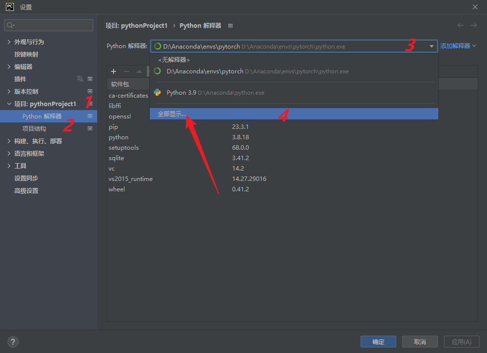

# 一、windows系统

## 1.conda环境创建

### （1）pytorch环境创建

conda的base环境在Anaconda里面，需要将pytorch环境也安装在同一个盘下。

查看虚拟环境：

```
conda info --envs
```

删除环境：

```
conda env remove --pytorch --all
```


#### 1）创建文件夹

需要在 D:\Anaconda\envs\下创建一个pytorch文件夹

#### 2）取消envs文件夹管理权限：

右击：属性--安全--编辑--添加--高级--立即查找

在搜索结果中选择everyone,双击，然后一直点确定






3）终端输入：

```
conda create-prefix D:\Anaconda\envs\环境名称 python=3.8
```


### （2）在pycharm里面设置解释器

打开pycharm随便一个文件，右下角点击：解释器设置--添加本地解释器



点击conda环境



conda可执行文件选择D:\Anaconda\\_conda.exe

使用环境选择pytorch,然后就创建成功



### （3）删除无用的pycharm解释器

点击：文件--设置--项目--python解释器，下拉找到全部显示，然后选中解释器，点减号就可以删除解释器了，还可以重命名



### （4）相关报错

1）The current user does not have write permissions to the target environment

解决：pytorch环境与base环境安装在不同的盘，需要重新安装pytorch环境。

2）Exception: HTTPSConnectionPool(host='repo.anaconda.com', port=443): Max retries exceeded with url: /pkgs/main/win-64/current_repodata.json (Caused by SSLError("Can't connect to HTTPS URL because the SSL module is not available."))

问题：无法通过pip install和conda install 安装包

解决：没有关梯子