# 一、windows系统

## 1.conda环境创建

### （1）pytorch环境创建

conda的base环境在Anaconda里面，需要将pytorch环境也安装在同一个盘下。

查看虚拟环境：

```
conda info --envs
```

删除环境：

```
conda env remove --pytorch --all
```


#### 1）创建文件夹

需要在 D:\Anaconda\envs\下创建一个pytorch文件夹

#### 2）取消envs文件夹管理权限：

右击：属性--安全--编辑--添加--高级--立即查找

在搜索结果中选择everyone,双击，然后一直点确定


3）终端输入：

```
conda create-prefix D:\Anaconda\envs\环境名称 python=3.8
```


### （2）在pycharm里面设置解释器

打开pycharm随便一个文件，右下角点击：解释器设置--添加本地解释器


点击conda环境


conda可执行文件选择D:\Anaconda\\_conda.exe

使用环境选择pytorch,然后就创建成功


### （3）删除无用的pycharm解释器

点击：文件--设置--项目--python解释器，下拉找到全部显示，然后选中解释器，点减号就可以删除解释器了，还可以重命名


### （4）相关报错

1）The current user does not have write permissions to the target environment

解决：pytorch环境与base环境安装在不同的盘，需要重新安装pytorch环境。

2）Exception: HTTPSConnectionPool(host='repo.anaconda.com', port=443): Max retries exceeded with url: /pkgs/main/win-64/current_repodata.json (Caused by SSLError("Can't connect to HTTPS URL because the SSL module is not available."))

问题：无法通过pip install和conda install 安装包

解决：没有关梯子

# 二、ubuntu22.04 ×86系统

### 1.安装nvidia显卡驱动

##### （1）下载并安装配件

```
sudo apt-get update   #更新软件列表
sudo apt-get install g++
sudo apt-get install gcc
sudo apt-get install make
```

##### （2）利用软件与更新直接下载驱动

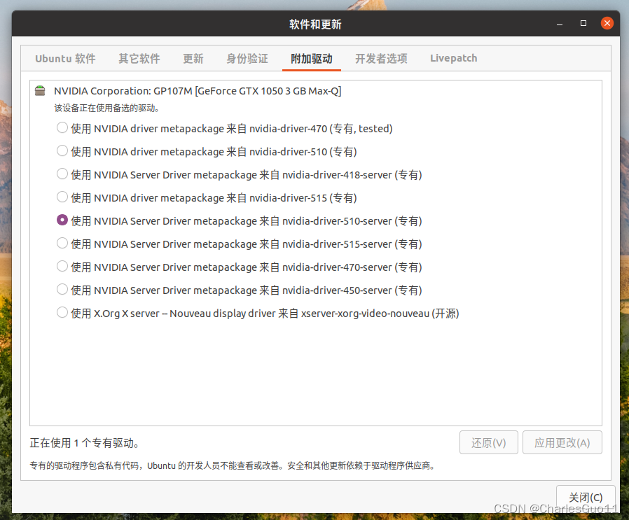

卸载原有驱动（若有）

```
sudo apt-get remove --purge nvidia*
```


##### （3）禁用Nouveau驱动

```
sudo gedit /etc/modprobe.d/blacklist.conf
```

在末尾添加：

```
blacklist nouveau
options nouveau modeset=0
```

更新初始 ram 文件系统，随后重启计算机

```
sudo update-initramfs -u
```

### 2.安装CUDA

##### （1）下载CUDA Toolkit，官方下载链接：

```
https://developer.nvidia.com/cuda-downloads
```

下载11.7.1版本的：

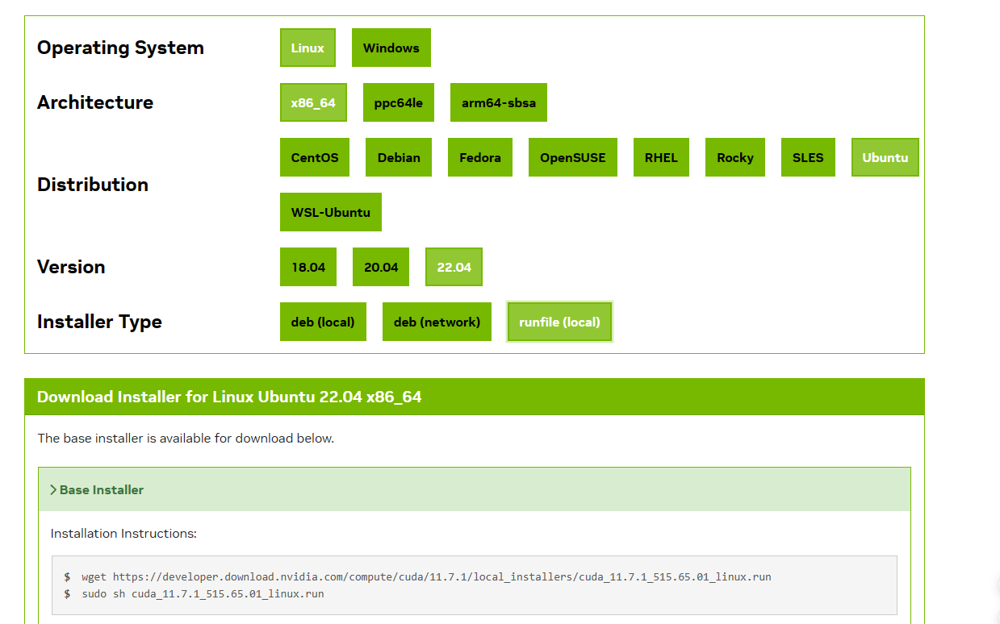

##### （2）输入安装指令

```
wget https://developer.download.nvidia.com/compute/cuda/11.7.1/local_installers/cuda_11.7.1_515.65.01_linux.run
sudo sh cuda_11.7.1_515.65.01_linux.run
```

安装过程中，首先输入**accept**，取消勾选**Driver**（已经安装了驱动），选择**Install**，回车

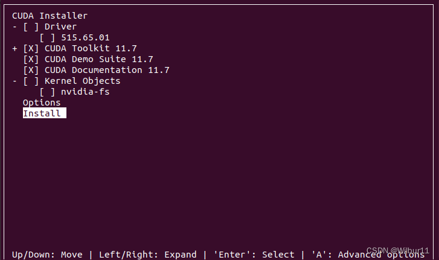

1）若第1步提示Existing package manager installation of the driver found. It is strongly recommended that you remove this before continuing.，选择continue，在下一步中去除driver项，之后选择install：

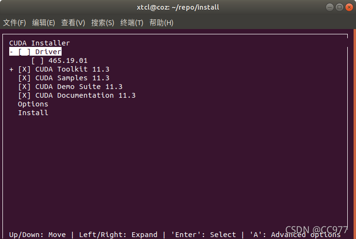

##### （3）安装完成

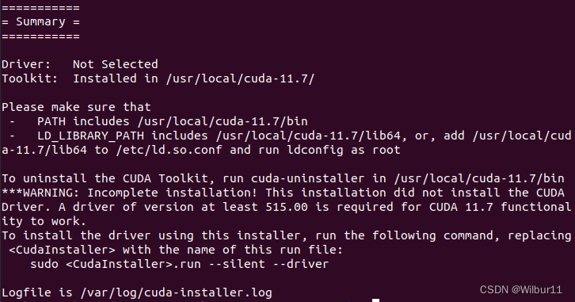

##### （4）在~/.bashrc文件中添加环境变量

主目录下按control+H显示隐藏文件

```
export PATH=/usr/local/cuda-11.7/bin:$PATH
export LD_LIBRARY_PATH=/usr/local/cuda-11.7/lib64:$LD_LIBRARY_PATH
```

##### （5）测试cuda安装

```
nvcc -V
```

输出如下，版本对应上就成功了：

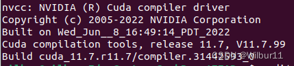

### 3.安装cudnn

##### （1）下载cudnn库

官方下载链接：

```
https://developer.nvidia.com/rdp/cudnn-archive
```

##### （2）解压下载好的tar.xz文件

```
tar -xvf cudnn-linux-xxx.tar.xz
```

##### （3）将解压的文件拷贝到cuda对应目录，进行cudnn的安装

在解压后的文件夹里打开终端

```
sudo cp include/cudnn.h /usr/local/cuda-11.7/include
sudo cp lib/libcudnn* /usr/local/cuda-11.7/lib64
sudo chmod a+r /usr/local/cuda-11.7/include/cudnn.h /usr/local/cuda-11.7/lib64/libcudnn*
```

### 5.安装Anaconda

##### （1）下载anaconda安装程序

```
https://www.anaconda.com/   #官网
https://mirrors.tuna.tsinghua.edu.cn/anaconda/archive/  #清华镜像源
```

##### （2）安装

cd进入下载到的目录中，用sh命令语言解释器运行.sh文件安装anaconda

```
sh Anaconda3-*.sh
```

一直按`Enter`，输入**yes**接受license，按`Enter`安装到ubuntu当前用户路径，等待**unpacking payload**

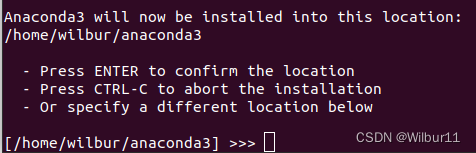

安装程序通过conda init初始化Anaconda3，输入**yes**，并**回车**

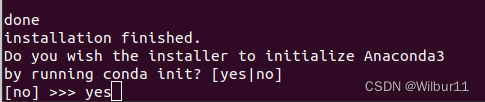

##### （3）添加环境变量

```
echo "export PATH=$PATH:/home/你自己的用户名/anaconda3/bin">> ~/.bashrc
```

source ~/.bashrc或重开终端生效，开始使用Anaconda吧～

##### （4）卸载Anaconda

1）完全卸载

```
conda install anaconda-clean
anaconda-clean --yes
```

2）标准卸载

```
rm -rf anaconda3
rm -rf ~/anaconda3
rm -rf ~/opt/anaconda3

# 将配置文件中anaconda的PATH都移除
# 在下述两个文件中找到anacodna3行并将其删除。之后，使用Ctlr+s保存文件。
sudo nano .bashrc
sudo nano .profile
```

### 5.安装pycharm

##### （1）官网下载

下载链接：下拉找到community版本的

```
https://www.jetbrains.com/pycharm/
```

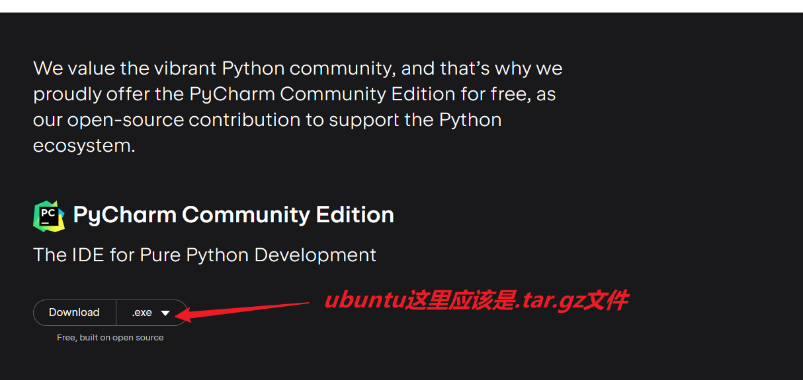

##### （2）解压

cd到download文件夹

```
tar -xvf pycharm***.tar.xz
```

##### （3）将pycharm移到opt文件夹下

```
sudo mv pycharm-community-2020.2.3/ /opt/
```

##### （4）进入pycharm文件夹下

```
cd /opt/pycharm-community-2020.2.3/bin
```

##### （5）启动pycharm

```
./pycharm.sh
```

### 6.安装pytorch

##### （1）创建虚拟环境

```
conda create -n mytorch python==3.8
```

##### （2）激活并进入虚拟环境

```
conda activate mytorch
```

##### （3）安装pytorch

官网链接：

```
https://pytorch.org/
```

往下拉，找到：

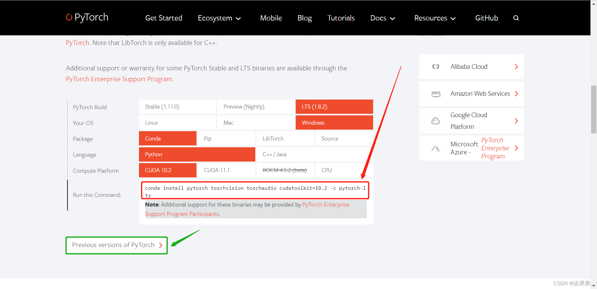

选择与cuda版本对应的pytorch，尽量选择conda安装的，选择1点几版本的。

**pytorch不是必装的，更像是在cuda的虚拟环境下安装一些包，便于管理**

##### （4）验证PyTorch是否安装成功

```
python 
import torch 
torch.cuda.is_available() 
```


验证完成后Ctrl+Z回到命令行，然后执行conda list指令就可以看到该虚拟环境下已经安装好的包

能够在conda list中找到以上两个包，则说明已经配置完成。

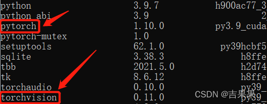