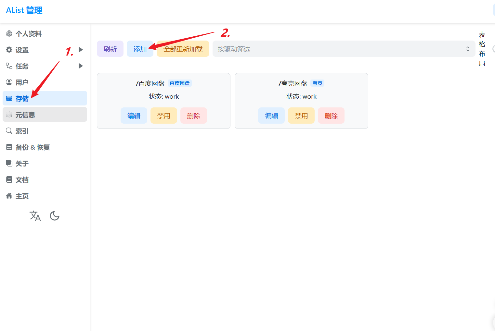
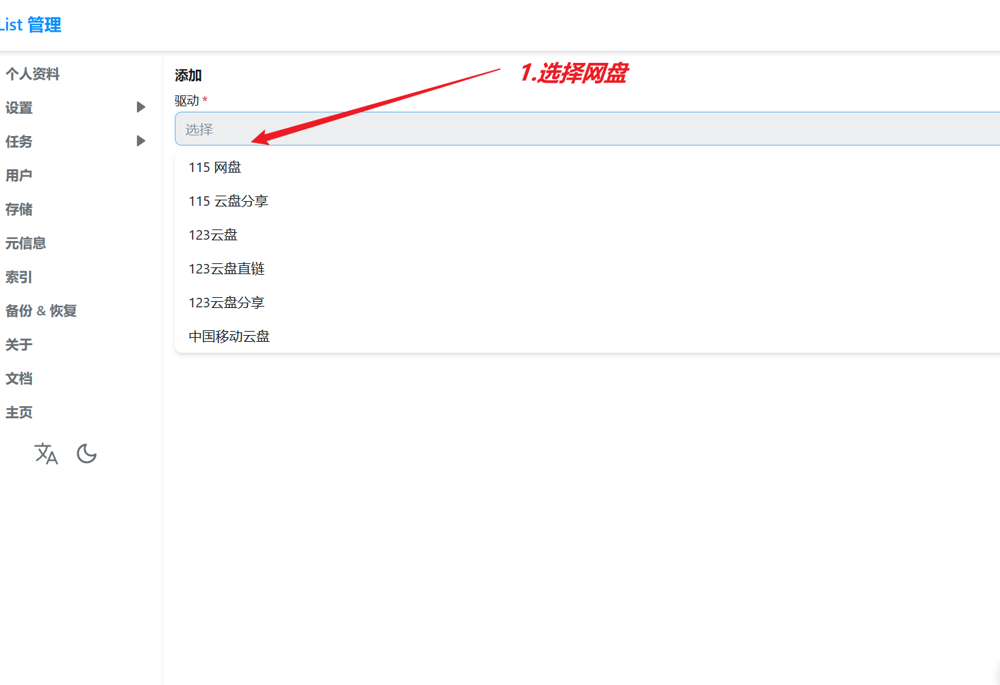
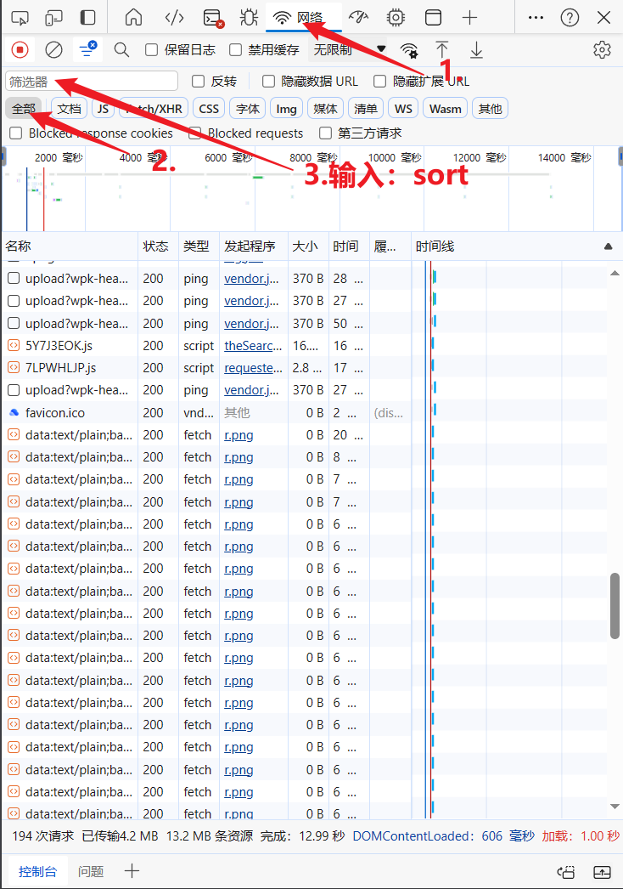
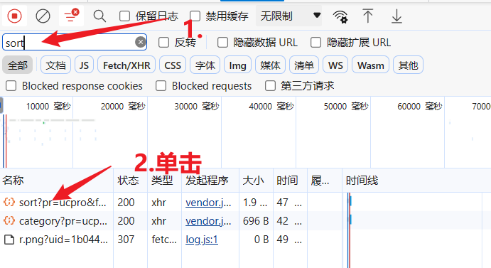
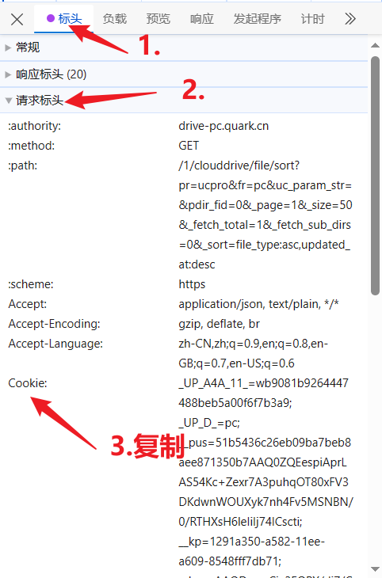

### 1.挂载夸克网盘

##### （1）打开“启动.vbs”进入：

```
http://127.0.0.1:5244/
```






##### （2）挂载路径填：

```
/夸克网盘
```

##### （3）填cookie值


按照（4）中的步骤粘贴到这里

##### （4）登录网页版夸克网盘

鼠标右键“检查"，进入开发者界面

点击网络--全部--刷新





