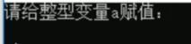
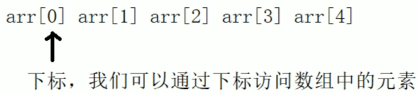

### 1.基础知识

##### （1）基础框架

创建文件：xxx.cpp

```
#include<iostream>
using namespace std:

int main()
{
	cout<<"hello world"<<endl;
	
	system("pause");    //使打印输出的内容能够暂停
	return 0;
}
```

##### （2）注释

单行注释：//

多行注释：

```
/*
注释的内容
*/
```

##### （3）变量创建

语法： 数据类型  变量名  =  变量初始值 ;

```
int a = 10;
```

##### （4）常量

#define 宏常量 宏常量值

```
#define Day 7     //不可进行修改
```

const  数据类型  变量名  =  变量初始值 ;

```
const int a = 10;   //a就变为常量，不可修改
```

##### （5）关键字

c++中预先保留的一些单词，在定义变量或者常量时候，不要用关健字

##### （6）标识符命名规则

字母、数字、下划线组成

### 2.数据类型

##### （1）整型

| 数据类型  | 占用空间 | 取值范围 |
| :-------: | :------: | :------: |
|   short   |  2字节   |   2^15   |
|    int    |  4字节   |   2^31   |
|   long    |  4字节   |   2^31   |
| long long |  8字节   |   2^63   |

##### （2）sizeof

统计数据类型所占内存空间

```
short a = 10;
sizeof(short)或者sizeof(a)
```

##### （3）浮点型

表示小数

| 数据类型 | 占用空间 | 有效数字范围 |
| -------- | -------- | ------------ |
| float    | 4字节    | 7位          |
| double   | 8字节    | 15-16位      |

##### （4）字符型

用于显示单个字符，占用一个字节

```
char ch = 'a';  //创建方式：单引号，且只能有一个字母
(int)ch   //将ch强转为10进制整型
```

##### （5）转义字符

```
/n   //换行
/t   //水平制表，/t占用8个空格
\\    //代表一个反斜杠\
```

##### （6）字符串型

char 变量名[] = "字符串值"

```
char str[] = "hello world";
```

string 变量名

```
#include<string>      //需要首先写一个头文件
string str = "hello world";
```

##### （7）布尔数据类型

bool占用一个字节

```
bool flag = true ; //flag的输出就是1
bool a = false ;   //a的输出就是0
```

##### （8）数据的输入

```
cin >> 变量  //从键盘输入变量的值
cin >> a ;
```



### 3.运算符

##### （1）算术运算符

|    运算符     |               术语               | 示例 | 结果 |
| :-----------: | :------------------------------: | :--: | :--: |
| +   -   *   / |             加减乘除             |      |      |
|       %       |               取模               | 10%3 |  1   |
|      ++       | 前置递增（先+1，后进行算术运算） |      |      |
|      ++       | 后置递增（先进行算术运算，后+1） |      |      |
|      --       |                                  |      |      |

##### （2）赋值运算符

| 运算符 |  术语  |   示例   | 结果 |
| :----: | :----: | :------: | :--: |
|   =    |  赋值  | a=6,a=2  | a=2  |
|   +=   | 加等于 | a=6,a+=2 | a=8  |
|   -=   | 减等于 | a=6,a-=2 | a=4  |
|   *=   | 乘等于 | a=6,a*=2 | a=12 |
|   /=   | 除等于 | a=6,a/=2 | a=3  |
|   %=   | 模等于 | a=6,a%=2 | a=0  |

##### （3）比较运算符

用于比较，返回0或1

| 运算符 |  术语  |  示例  | 结果 |
| :----: | :----: | :----: | :--: |
|   ==   | 相等于 |  4==3  |  0   |
|  ！=   | 不等于 | 4！=3  |  1   |
|  <(>)  |        | 4 > 3  |  1   |
| <=(>=) |        | 4 >= 3 |  1   |

##### （4）逻辑运算符

判断真假，返回0或1

| 运算符 | 术语 | 示例 |               结果               |
| :----: | :--: | :--: | :------------------------------: |
|   ！   |  非  | ！a  |    a为真，输出0；a为假，输出1    |
|   &&   |  与  | a&&b |   a与b都为真，输出1；否则输出0   |
|  \|\|  |  或  |      | a与b有一个为真，输出1；否则输出0 |

### 4.程序流程结构

##### （1）选择结构

if**语句**

|  结构  |                             语法                             |
| :----: | :----------------------------------------------------------: |
|  单行  |               if（条件）{条件满足执行的语句}；               |
|  多行  |  if（条件）{条件满足执行的语句}else{条件不满足执行的语句}；  |
| 多条件 | if（条件1）{条件1满足执行的语句}else if（条件2）{条件2满足执行的语句}...else{都不满足执行的语句}； |
|  嵌套  |                                                              |

**switch语句**

```
switch(表达式)          //执行多条件分支语句
{
	case 结果1:执行语句;break;   //break的作用是跳出switch,否则会一直执行下去
	case 结果1:执行语句;break;
	...
	default:执行语句;break;
}
```

```
switch(score)   //判断的时候只能是整数型，不能是区间。但结构清晰，执行效率高
{
case 10;
	cout<<"好"<<endl;
	break;
case 9;
	cout<<"较好"<<endl;
	break;
case 8;
	cout<<"一般"<<endl;
	break;
case 7;
	cout<<"较差"<<endl;
	break;  
default
	cout<<"很差"<<endl;
	break；
}
```

##### （2）循环结构

**while循环语句**

while（循环条件）{循环语句}

只要循环条件为真，就执行循环语句

```
int num = 0;
while(num < 10)
{
	cout<<num<<endl;
	num++;
}
```

**do...while循环语句**

先执行一次循环语句，再判断循环条件

```
do{循环语句}while(循环条件);
```

**for循环语句**

满足循环条件，执行循环语句

```
for(起始表达式;条件表达式;末尾循环体){循环语句;}
```

```
//先执行int i=0,然后判断i<10?,再执行cout i,最后执行i++
for(int i = 0; i < 10; i++)
{
	cout<< i <<endl;
}
```

##### （3）跳转语句

**break语句**

跳出选择或者循环结构

**continue语句**

在循环语句中，跳过本次循环中余下尚未执行的语句，继续执行下一次循环

```
for(int i = 0; i < 100; i++)
{
	if(i % 2 == 0)
	{
		continue;         //退出当前选择结构，结果是输出奇数
	}                     //如果是break，就会跳出循环结构，结果不输出任何东西
	cout<< i <<endl;
}
```

**goto语句**

无条件跳转语句

```
cout<<"1、xxx"<<endl;
cout<<"2、xxx"<<endl;
goto FLAG;
cout<<"3、xxx"<<endl;
cout<<"4、xxx"<<endl;
FLAG:
cout<<"5、xxx"<<endl;
```

### 5.数组

##### （1）概述

数组是一个存放相同类型数据元素的集合（连续的内存空间中）



##### （2）一维数组

**定义方式：**

```
int arr[5];  //数组元素从零开始索引，[5]中的5代表有五个元素，而不是arr[5]
int arr2[5] = {10,20,30,40,50};   //没达到5个元素，会用0进行填充
int arr3[] = {90,80,70,60,50,40,30,20,10};
```

**数组名：**

统计数组在内存中的长度

```
sizeof(arr)
sizeof(arr)/sizeof(arr[0])   //获取元素个数
```

**冒泡排序**

对数组内的元素进行排序，比较相邻元素，如果第一个数比第二个数大就交换位置

##### （3）二维数组

**定义方式：**

```
int arr[行数][列数]；
int arr[2][3] = 
{
	{1,2,3,}，
	{4,5,6}
}；
int arr[2][3] = {1,2,3,4,5,6}；
int arr[][列数] = {1,2,3,4,5,6}；
```

### 6.函数

##### （1）概念

将一段常用的代码封装起来，减少重复代码。

较大程序，一般分为若干程序块，每个模块实现特定功能

##### （2）定义

```c++
返回值类型 函数名 （参数列表）
{
	函数体语句
	
	return 表达式
}
```

```c++
//比较函数，实现两个整型数字的比较，返回较大的值
int max(int a, int b)
{
	return a > b ? a: b;
}
```

##### （3）函数的调用

```c++
//定义加法函数
int add(num1, num2)
{
	int sum = num1 + num2;
	return sum;
}
//调用add函数
int main()
{
	int a = 10;
	int b = 20;
	int c = add(a, b);  //称a和b为实参，c为形参
}
```

##### （4）值传递

如果函数不需要返回值，声明的时候可以写void

```c++
void swap(num1, num2)
{
	int temp = num1;
	num1 = num2;
	num2 = temp;
}
```

##### （5）函数的样式

```
1.无参无返
void test1()
{
cout<<"this is test1"<<endl;
}
2.有参无返
3.无参无返
4.有参有返
```

##### （6）函数的声明

```
提前告诉编译器函数的存在
int main(int a, int b);   //写在调用函数的前面
//声明可以写多次，但函数定义只能写一次
```

##### （7）函数的分文件编写

让代码的结构更加清晰

```
步骤：
1.创建后缀为.h的头文件
2.创建后缀为.cpp的源文件
3.在头文件中写函数的声明
4.在源文件中写函数的定义
```

```c++
// hanshu.h
#include<iostream>
using namespace std;

void swap(int a, int b);
```

```c++
//  hanshu.cpp
#include"hanshu.h"
void swap(int a, int b)
{
    int temp = a;
    a = b;
    b = temp;
}
```

### 7.指针

##### （1）基本概念

通过指针间接访问内存，保存地址

```c++
//数据类型*指针名变量
int a = 10;
int * p;
p = &a;    //让指针记录a的地址
// 指针前加*代表解析引用，找到指针指向的内存中的数据
*p = 1000;
```

##### （2）空指针

指针变量指向内存中编号为0的空间

作用：初始化指针变量

```c++
int *p = NULL;  //空指针不可进行访问，0~255之间的内存编号是系统占用的，不可进行访问
```

##### （3）野指针

指针指向非法的内存空间

```c++
int *p = (int*)0x1100;
```

##### （4）const修饰指针

```c++
int a = 10;int b = 10;
//1.const修饰指针
const int * p = &a;  //指针指向的值不可以改，指针的指向可以修改
// *p = 20;  错误
//2.const修饰常量
int *const p2 = &a;  //值可以修改，指向不可以修改
*p2 = 100;
//3.const修饰指针和常量
const int * const p = &a;  //都不可以修改
```

##### （5）指针和数组

利用指针访问数组中的元素

```c++
int arr[] = {1,2,3,4,5,6,7,8,9};
int *p = arr;  //arr就是数组的首地址
p++;  //让指针向后偏移4个字节
```

##### （6）指针和函数

```c++
//地址传递,可以修饰实参
void swap(int *p1, int *p2)
{
	int temp = *p1;
	*p1 = *p2;
	*p2 = temp;	
}
swap(&a, &b);
```

##### （7）指针、数组、函数

封装一个函数，利用冒泡排序，实现对整形数组的升序排列

### 8.结构体

##### （1）基本概念

结构体属于用户自定义的数据类型，允许用户存储不同的数据类型。（一些数据类型的集合）

```c++
//1.创建学生数据类型：包含（姓名，年龄，分数）
struct Student
{
	string name;
	int age;
	int score;
}s3;
//2.通过学生类型创建具体学生
int main()
{
//2.1 struct Student s1
	stuct Student s1;  //struct可以省略
	s1.name = “张三”; //通过.给s1属性赋值，访问结构体变量中的属性
	s1.age = 18;
	s1.score = 100;
//2.2 struct Student s2 = {...};
	struct student s2 = {"李四",19,60};
//2.3在定义结构体时顺便创建结构体，需要先在定义结构体后面加上s3
    s1.name = “王五”; 
	s1.age = 18;
	s1.score = 100;
}
```

##### （2）结构体数组

作用：将自定义的结构体放入到数组中方便维护

```c++
struct 结构体名 数组名[元素个数] = {{}，{}，...,{}}

//1.定义结构体
struct student
{
	string name;
	int age;
	int score;
};

//2.创建结构体数组，给结构体中的元素赋值
struct student stuArray[8] = 
{
	{"张三"，18,100}，
	{"李四",28,99}，
	{"王五",18,66}
}

//3.给结构体中的元素赋值
stuArray[2].name = "赵六";
stuArray[2].age = 18;
stuArray[2].score = 88;

//4.遍历结构体数组
for(int i = 0;i<3; i++)
{
	cout<<<<stuArray[i].name<<stuArray[i].age<<stuArray[i].score<<endl;
}
```

##### （3）结构体指针

指针通过“->”访问结构体

```c++
struct student 
{
    string name ;
    int age;
    int score;
};

int main()
{
    //1.创建学生结构体变量
    student s = {"张三",18,100};

    //2.通过指针指向结构体变量
    struct student *p = &s;

    //3.通过指针访问结构体变量中的数据 
    cout<<"姓名："<<p->name<<"年龄："<<p->age<<"分数："<<p->score<<endl;
```

##### （4）结构体嵌套结构体

```c++
struct student 
{
    string name ;
    int age;
    int score;
};

struct teacher
{
    int id;
    string name;
    int age;
    struct student stu;
};

int main()
{
    struct teacher t;
    t.id = 1000;
    t.name = "老王";
    t.age = 36;
    //t.stu = {"小王", 18, 89};
    t.stu.name = "小王"；
    t.stu.age = 18;
    t.stu.score = 89;
}
```

##### （5）结构体做函数参数

作用：将结构体作为参数向函数中传递

```
不想修改主函数中的数据，用值传递，反之用地址传递
```

##### （6）结构体中const使用场景

```c++
struct student 
{
    string name ;
    int age;
    int score;
};

//将函数中的形参改为指针，可以减少内存空间，而且不会复制出新的副本出来
void printStudent(const student *s)
{
    //s->age = 150;
    //加入const之后，一旦有修改的操作就会报错，可以防止我们的误操作
    cout<<s->name<<s->age<<s->score<<endl;
};


int main()
{
    struct student s;
    s.name = "张三";
    s.age = 18;
    s.score = 22;
    printStudent(&s);
}
```

