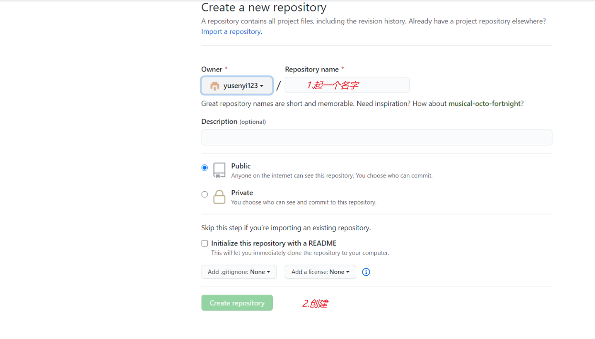

## 1.破解版Typora安装

#### （1）下载软件

网盘链接：

https://pan.baidu.com/s/1PCAC4aWHtkG-1xDMLH3BKQ?pwd=zw99

运行setup.exe安装（不要安装在有空格的目录中）

#### （2）安装插件

将winmm.dll复制到安装目录下

注意：后续typora会弹出更新，一定不要更新！！！

## 2.Typora与github关联

#### （1）图像设置

点击：文件-->偏好设置-->图像


 新建文件夹：assets，并右击：属性-->隐藏文件夹

#### （2）Markdown语法设置

将大部分功能打开


# 3.Git安装——用于托管笔记

### 3.1git安装和设置环境变量

#### （1）软件下载安装

```
https://git-scm.com/downloads
```


#### （2）安装

可以安装简易版即可，安装包下载到电脑之后，就点击安装，一直下一步即可。

#### （3）环境配置

右击：电脑属性-->高级系统设置-->环境变量-->系统变量-->Path-->新建

将  D:\Git\cmd  添加进去

### 3.2生成ssh公钥

使用ssh公钥不需要每次向github提交都输入密码

#### （1）安装quicker

#### （2）在quicker中添加两个动作

https://getquicker.net/Sharedaction?code=d49471e9-8176-4f5a-d1c3-08d8423ccd55&fromMyShare=true

https://getquicker.net/Sharedaction?code=bf3da905-e641-4bc8-668d-08d841787f87&fromMyShare=true


打开上面两个网站之后，点击复制到剪切板


在quicker里面点击+粘贴动作

#### （3）获取ssh公钥

运行quicker中添加的第一个动作，一直按回车键。然后会得到一串公钥，将其复制。

然后打开自己账号的github首页，点击settings，点击New SSH key，粘贴公钥


#### （4）在github中新建仓库，获取仓库的ssh链接

点击：New repository创建新仓库，并复制仓库的ssh链接




### 3.3初始化和远程同步

#### （1）quicker脚本

运行quicker脚本，将复制的仓库ssh链接粘贴，然后enter

#### （2）远程同步

以后每次写完笔记之后，就可以运行quicker的第二个动作进行同步github


# 4.解决图像不显示问题

### 4.1本地.md文件不显示图片

##### 问题原因

显示.md文件的软件不支持图片显示

##### 解决方法

在系统默认应用设置里面将.md文件默认打开软件改为Typora即可

### 4.2github上不显示图片

##### 问题原因

图片存放的位置有问题，文件夹设置有问题

##### 解决方法

assets文件夹（专门存放图片的）与文件放在同一文件夹下（如：notebook）,notebook为github与本地关联的一个文件夹，不要将文件放在notebook外边，也不要修改notebook名称。


然后，在Typora的文件 --> 偏好设置 --> 图像里面修改插入图片的路径，改到assets文件夹下（注意改为相对路径，绝对路径容易不显示图片）


#### 以上参考文章：

[notebook/Typora使用/Typora+github-云笔记本1.0.md at master · yusenyi123/notebook](https://github.com/yusenyi123/notebook/blob/master/Typora使用/Typora%2Bgithub-云笔记本1.0.md)

