# 1.旧版ubuntu卸载

### （1）把开机启动项设为默认Windows启动

拯救者笔记本开机长按F2；台式机长按F1进入BIOS界面

将win移动到ubuntu前面

### （2）删除Ubuntu系统分区

进入磁盘管理：按win+R,输入

```
diskpart   
list disk
```

找到windows系统所在盘（注意不是ubuntu所在盘），一般为0，进入：

```
select disk 0   #进入磁盘0
```

```
list partition  #查看当前磁盘所有分区
```

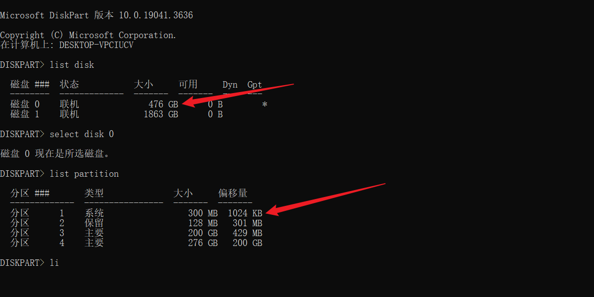

260 M 左右的那个即为 EFI 系统分区，输入：

```
select partition 1    #选择分区
assign letter=p   #为其分配一个 p 盘符(不区分大小写)，注意不要关闭此窗口
```

用管理员身份打开记事本，点击“文件”--“打开”--“此电脑”

选择p盘进入，

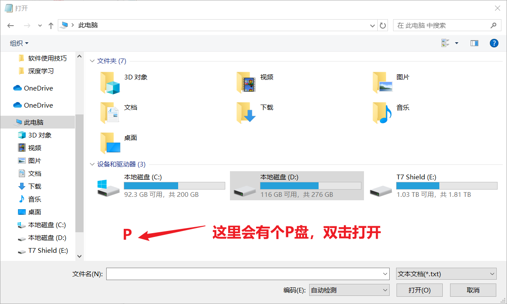

**进入EFI文件夹，删除Ubuntu文件夹**

**返回刚刚的命令行，删除刚刚分配的盘符。可以看到又回归原来状态**

```
remove letter=p
```

# 2.ubuntu20.04安装

### 2.1 需要资源

（1）U盘一个（提前备份数据）

（2）Ubuntu 20.04 LTS 镜像

- 下载地址（清华园）：

  ```
  https://mirrors.tuna.tsinghua.edu.cn/ubuntu-releases/20.04/
  ```

  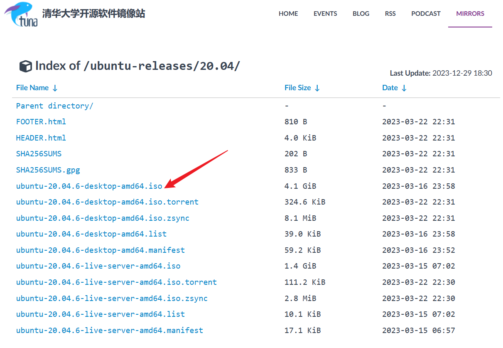

  官网：

  ```
  https://ubuntu.com/download/desktop
  ```

  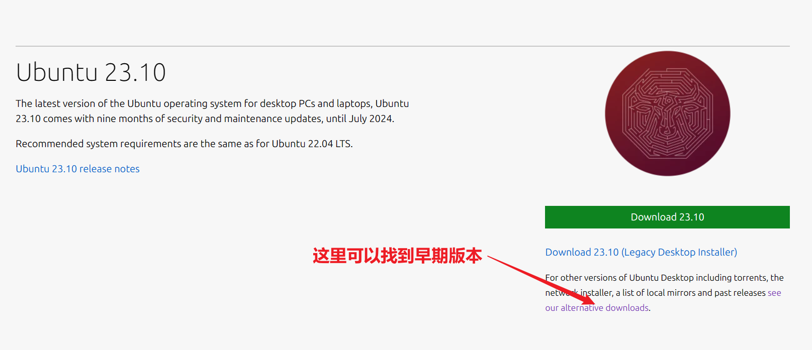

（3）Rufus–1008.05kb 启动工具

下载地址：

```
https://rufus.ie/zh/
```

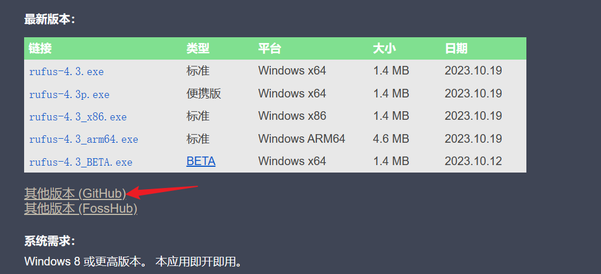

### 2.2 window设置

##### （1）分区

在桌面上，点击计算机图标（右键）–> 管理 --> 找到磁盘管理，之后找一个比较大的硬盘分区点击一下

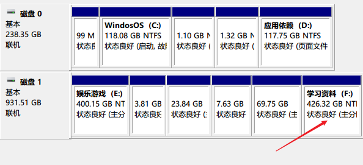

右键选择压缩卷

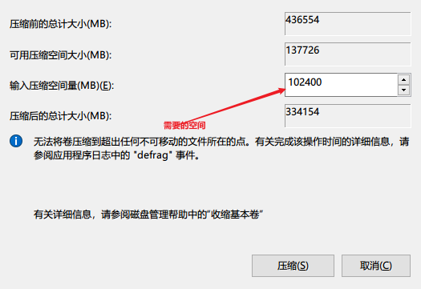

##### （2）制作启动盘

打开Rufus制作工具

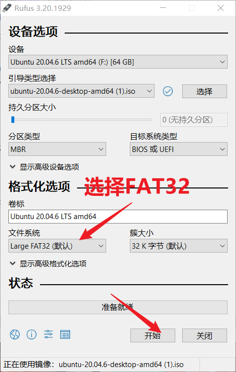

选择好对应的iso镜像，分区类型选择MBR，开始制作启动盘。

### 2.3 ubuntu安装

##### （1）进入Bios设置U盘启动。

重启电脑，一直按BIOS按键

拯救者笔记本：F2

台式机：F1

##### （2）U盘启动后会出现黑色界面的引导界面。选择Ubuntu

进入到ubuntu安装界面、选择中文

##### （3）选择布局

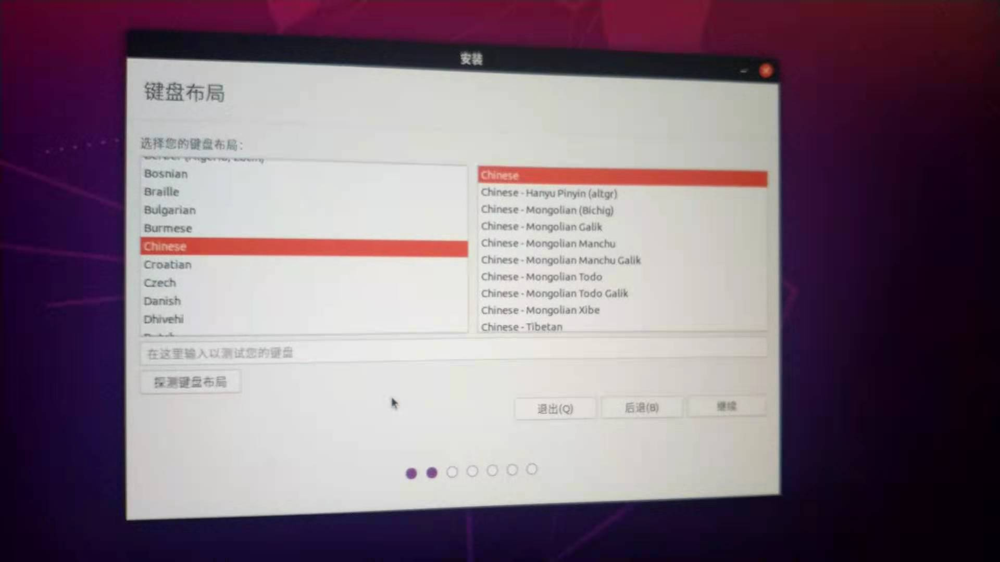

##### （4）连接网络

##### （5）选择最小安装。如果连了网络可以把下面两个选项也勾上。

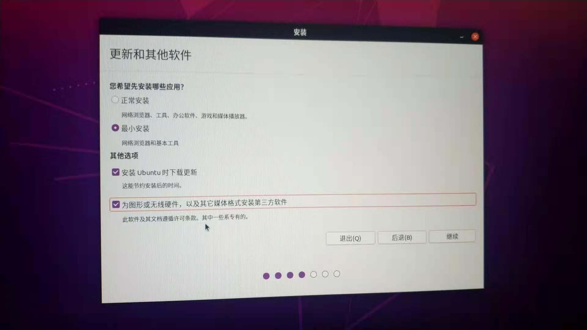

##### （6）选择安装类型，这里我们自定义安装，选择其他选项。如果不想折腾也可以简单选择第一个选项。

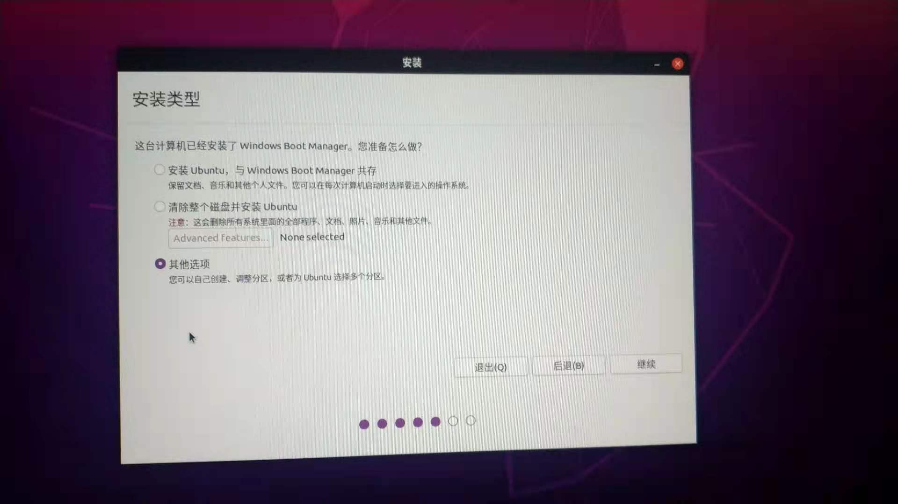

##### （7）分区，这是最重要的一点，前面我们预留了硬盘空间这里就用上了，我们点击空余空间，点 + 号新建分区。

这里我们要分四个区域，分别是

- / 根目录整个系统的大区域一般15G以上。

- /boot 启动目录，开机启动所需目录。（200M-2G）

- swap 交换空间，一般和内存一样大。（16G）

- /home 家目录，就是我们自己存放用户数据的目录。一般有多少给多少

  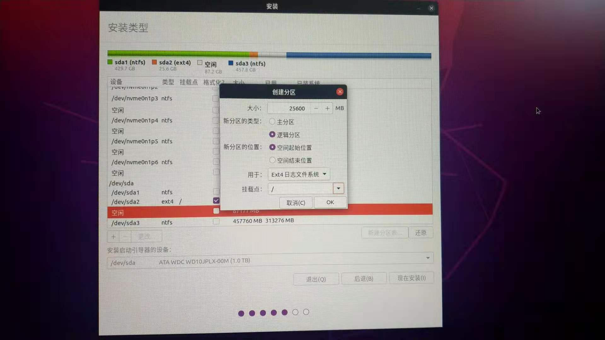

  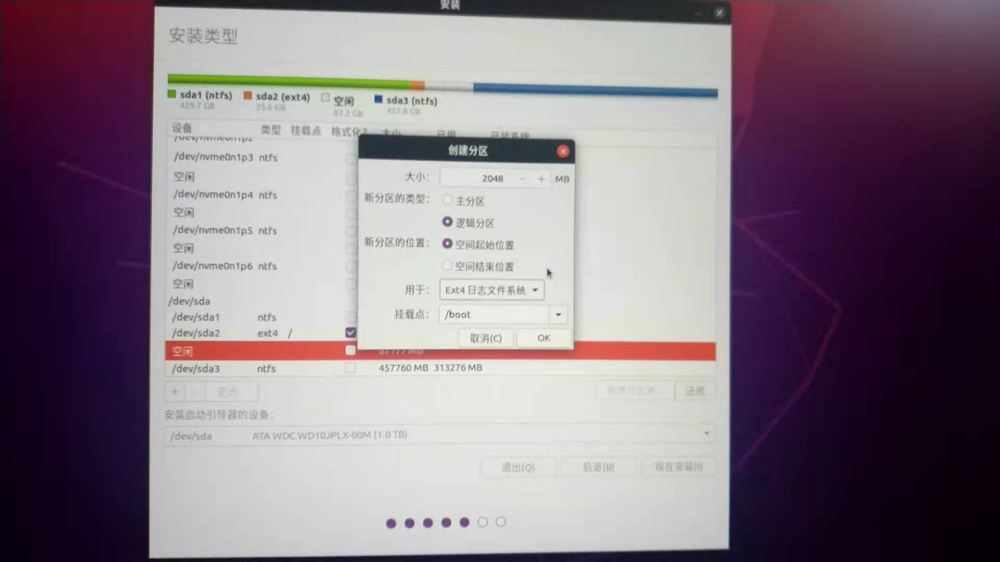

  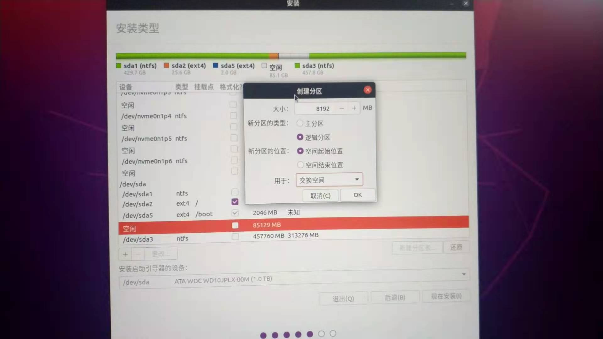

  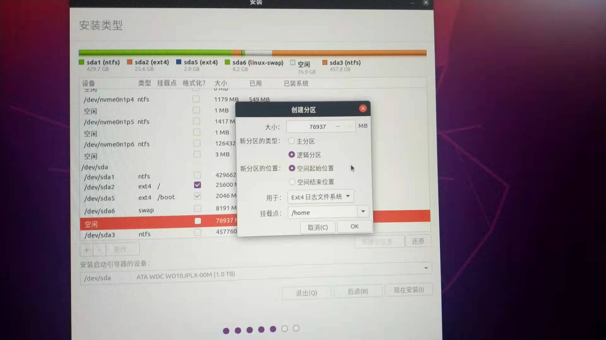

##### （8）选择时区，shanghai

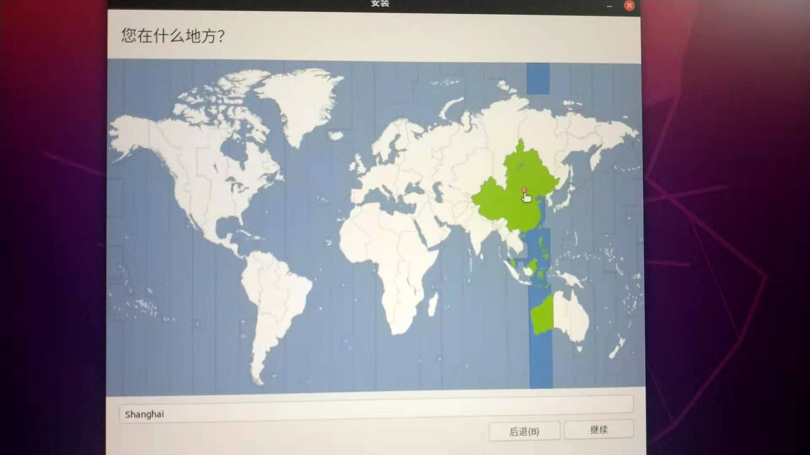

##### （9）设置用户

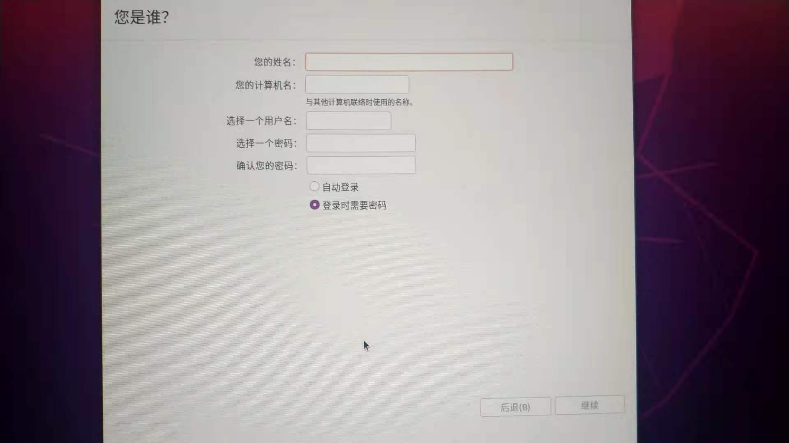
