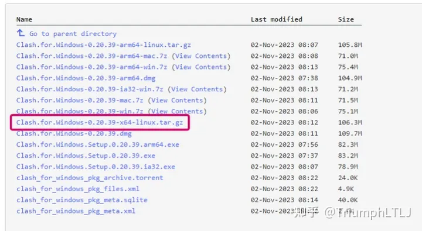
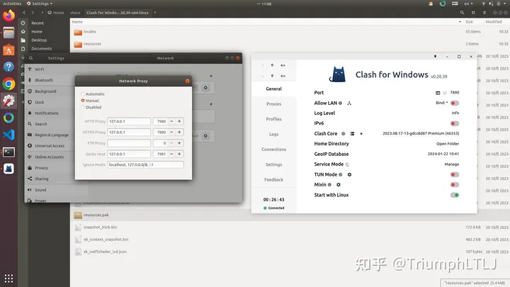
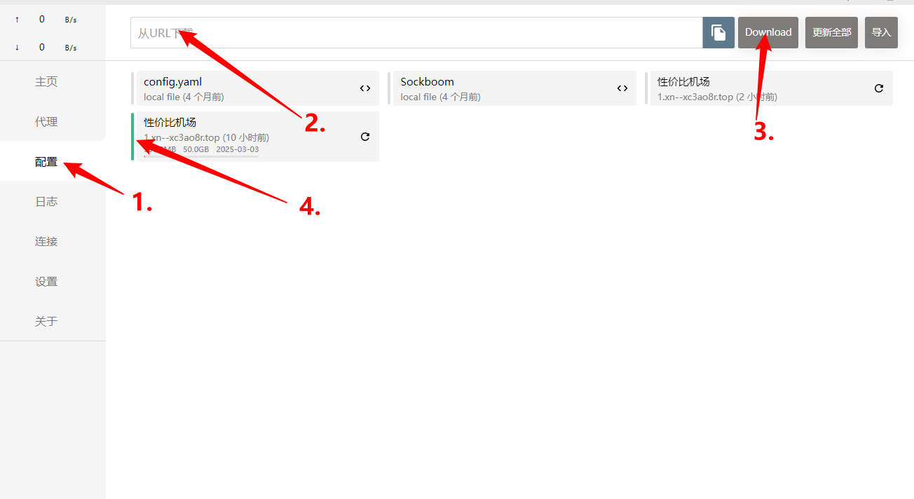

### 1.arm板

##### （1）安装

需要挂梯子打开

```
https://archive.org/download/clash_for_windows_pkg
```



解压：

```
tar -xzvf Clash.for.windows-0.20.39-x64-linux.tar.gz
```

进入解压后文件夹：

```
cd  Clash.for.windows-0.20.39-x64-linux
```

运行界面：

```
./cfw
```

出现以下界面：



##### （2）购买订阅

```
https://www.xingjiabijichang.com
```


##### （3）配置文件

