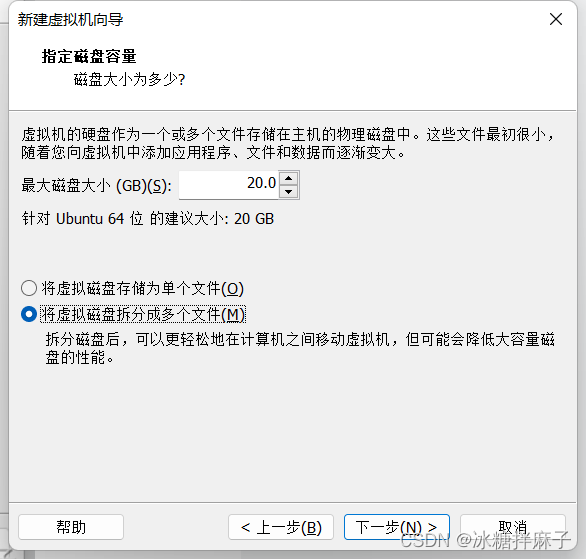

### 1.下载VMware Wworkstation Pro

##### （1）下载

```
https://www.vmware.com/products/workstation-pro/workstation-pro-evaluation.html
```

##### （2）许可证

```
MC60H-DWHD5-H80U9-6V85M-8280D
```

### 2.安装虚拟机

##### （1）新建虚拟机


##### （2）安装映像

去ubuntu官网下载一个ubuntu映像文件

```
https://cn.ubuntu.com/download/desktop
例如：
```


这里的路径还是可以改一下的，尽量自己记住，然后点击下一步下一步就好




##### （3）ubuntu安装

安装完成后，虚拟机就会自动打开，点击continue就好


如果出现这个，如果你之前没有安装过虚拟机就直接点install now就好


安装完成之后如果想改成中文，可以去setting中的language修改语言，修改完语言重启之后会提示你把原始的英文目录更改为中文，点击update就可以。


